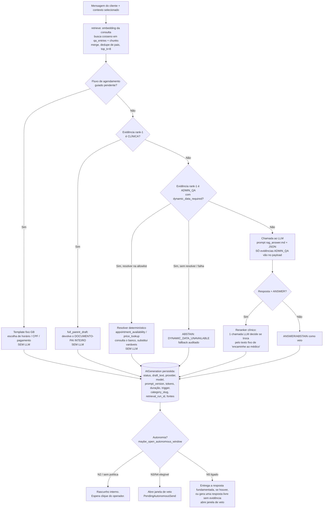

# EXPLICAÇÃO — Plataforma de Atendimento com IA (estudo de caso / portfólio)

> Documento de leitura única, em português, escrito para **apresentar o que foi
> aprendido** neste desenvolvimento: a stack, as decisões de arquitetura, o
> método de trabalho (Codex no início, Claude Code no desenvolvimento), o
> funcionamento do RAG e do LLM, o banco vetorial e o banco relacional, as três
> telas do produto, os graus de autonomia N1–N5 e a plataforma de agendamento.
>
> **Natureza do projeto:** é um sistema **fictício de demonstração técnica**.
> A instituição, os profissionais, os procedimentos, o conteúdo clínico, os
> preços, o pagamento e o CPF são todos simulados. Não há paciente, serviço de
> saúde ou dado real por trás — e isso é uma condição de projeto, não um
> acidente (ver "Constituição" e "Agendamento" abaixo).

---

## 1. Linha do tempo e números do projeto

| Item | Valor |
|---|---|
| Primeiro commit | `66d63b0` — 2026-08-08 (`feat: add oncology RAG content and scheduling platform`) |
| Último commit | `a786467` — 2026-08-21 (`fix: N5 skips GB's own drafts…`, correção D-043-2) |
| Janela de desenvolvimento | ~2 semanas corridas (8 a 21 de agosto de 2026) |
| Commits | 69 |
| Pacotes SDD (ciclos de especificação) | 11 (`specs/001` … `specs/011`) |
| Tarefas T-numeradas (soma dos `tasks.md`) | ≈ 473 |
| Migrações Alembic | 28 (`20260810_0001` … `20260821_0005`) |
| Testes de backend (pytest) na última rodada credenciada | 247/247 |
| Scripts de smoke E2E | 18 |
| Cenários Playwright | 16 passando + 1 skip por design |

Contagem de tarefas por pacote (identificadores `T…` únicos em cada `tasks.md`):

| Pacote | Tarefas | Pacote | Tarefas |
|---|---|---|---|
| 001 — V1 assisted customer service | 140 | 007 — completed-booking visibility | 14 |
| 002 — V2 commercial product experience | 91 | 008 — customer-facing draft status | 4 |
| 003 — V3 measured N2 | 72 | 009 — two-phase clinical evidence | 3 |
| 004 — dynamic appointment availability | 33 | 010 — governed autonomous response (N3/N4) | 25 |
| 005 — dynamic pricing & guided booking | 48 | 011 — ungoverned fictional-demo autonomy (N5) | 24 |
| 006 — specialty scheduling breadth | 15 | | |

---

## 2. Método de trabalho: SDD, Codex e Claude Code

### 2.1 Spec-Driven Development (Spec Kit)

Todo o projeto seguiu um ciclo de vida canônico, registrado em `AGENTS.md` e
`CLAUDE.md`:

```
constitution → specify → clarify → plan → tasks → analyze → implement → converge
```

- **`.specify/memory/constitution.md`** é a autoridade máxima depois da
  instrução humana da sessão. Ela fixa invariantes de segurança (ver §12) e só
  muda por **emenda** explícita (houve três: 1.1.0, 1.2.0, 1.3.0).
- Cada feature tem um **pacote** em `specs/NNN-…/` com `spec.md`, `plan.md`,
  `data-model.md`, `tasks.md`, `contracts/openapi.yaml`, `acceptance.md`,
  `analysis.md` e checklists.
- **`analyze`** (revisão de consistência entre artefatos) roda **antes** de
  escrever código; **`converge`** (revisão spec↔código) roda **depois**. Vários
  defeitos reais foram encontrados justamente nessa etapa de convergência, não
  pelos testes de build.
- Ordem de autoridade quando há conflito: instrução humana → constituição →
  `spec.md` → `plan.md` → `tasks.md` → docs de arquitetura → ADRs → roadmap.
  Nunca "inventar" a resolução: consertar o artefato de maior autoridade.

### 2.2 Dois agentes de codificação

O repositório foi montado para ser operado por **dois agentes distintos**, com
contratos separados:

| Fase | Agente | Contrato | O que fez |
|---|---|---|---|
| Bootstrap | **Codex** | `AGENTS.md` + `PROMPT_START_V1.md` | Preparou o repositório inicial: as 5 *schemas* do PostgreSQL, o corpo de conteúdo oncológico (RAG), a plataforma de agendamento simulada, ~60 documentos de especificação e a primeira versão da constituição. Os primeiros commits (`66d63b0`, `baf508f`, `288a5f2`) são dessa fase. |
| Implementação | **Claude Code** | `CLAUDE.md` (delega para `AGENTS.md`) | Assumiu a partir do `analyze` do V1 e executou todos os 11 ciclos SDD: V1 → V2 → V3 → 004 → 005 → 006–009 → 010 → 011, mais as correções D-028 a D-043-2, o deploy em produção e as revisões de fechamento. |
| Verificação independente | Codex (pontual) | `PROMPT_REVIEW_V1_CLAUDE.md` / handoffs | Revisões *read-only* de fechamento (ex.: handoff da Fase 10 do pacote 004 para "um agente novo", commit `2d07d34`). |

Todos os commits estão sob o mesmo autor Git (`doug`); a distinção Codex/Claude
Code é de **ferramenta e de contrato de trabalho**, não de autoria. O valor da
separação foi ter uma segunda leitura independente sobre o mesmo material
canônico.

---

## 3. Stack tecnológica

### Backend (`app/`)

- **Python 3.11+**, **FastAPI**, **Pydantic**, **SQLAlchemy 2.x**, **Alembic**.
- **PostgreSQL 17** + **pgvector** (extensão `vector`), além de `pgcrypto` e
  `unaccent`.
- Provedor de LLM/embeddings atrás de **ports/adapters** (interface
  `GenerationProvider` / `EmbeddingProvider`). Adapter inicial: **OpenAI**.
  - Geração: `gpt-5-mini` (configurável em `AI_GENERATION_MODEL`).
  - Embeddings: `text-embedding-3-small`, **1536 dimensões**
    (`AI_EMBEDDING_MODEL` / `AI_EMBEDDING_DIMENSION`).
  - Adapter alternativo **determinístico** (`deterministic-test`) para testes
    sem custo/rede — hash SHA-256 como "embedding", texto fixo como "geração".
- **Sem** LangChain, LlamaIndex, Redis, Kafka, Celery, microserviços ou banco
  vetorial separado — proibidos por constituição (Art. VIII) até que um
  requisito medido justifique.

### Frontend (`frontend/`)

- **React + TypeScript + Vite**, **React Router**. SPA único com três rotas.
- ~1.200 linhas em `src/main.tsx` + `styles.css` (design system próprio,
  *theme-aware*). Sem framework de UI externo.
- Comunicação por `fetch` em `/api/v1`, *polling* a cada 2 s (sem WebSocket,
  sem streaming — decisão de V1).

### Runtime e infraestrutura

- **Local:** Docker Compose (`db`, `backend`, `frontend`, perfil opcional
  `ingest`). Nenhuma dependência de nuvem para aceitação.
- **Produção:** ver §13.

### Estilo arquitetural

**Monólito modular** com regra de dependência estrita:

```
UI web / futuro adaptador de canal
        │
        ▼
FastAPI (transporte/controllers)
        │
        ▼
serviços de aplicação
   │        │         │
   ▼        ▼         ▼
domínio   porta IA   porta RAG
políticas   │         │
            ▼         ▼
         adapter    adapter pgvector
         provedor       │
              └────┬────┘
                   ▼
              PostgreSQL
```

O código de domínio/aplicação **não** depende de componentes React, de objetos
de request do FastAPI nem de tipos de resposta do SDK da OpenAI. O núcleo de
conversas/serviços é **neutro de canal** (para permitir um futuro adaptador
Telegram sem duplicar lógica).

Módulos lógicos (`app/customer_care/`): `auth`, `anonymous_access`,
`conversations`, `autonomy`, `operator_workspace`, `knowledge`, `rag`, `ai`,
`audit`, `scheduling`, `booking_script`, `evaluation`, `shared`,
`infrastructure`.

### 3.4 Por que **não** foi preciso LangChain nem LangGraph

`AGENTS.md` proíbe explicitamente adicionar LangChain, LlamaIndex, Redis, Kafka,
Celery, microserviços ou banco vetorial separado "a menos que um requisito de
feature ativo, já analisado, prove a necessidade". Essa necessidade nunca
apareceu — pelos seguintes motivos concretos:

- **O RAG aqui é uma consulta SQL, não um pipeline.** Recuperar = embedar a
  consulta (uma chamada ao adapter) + dois `SELECT … ORDER BY embedding <=>
  $vetor LIMIT k` no pgvector + um merge/dedupe em Python (~40 linhas em
  `rag/service.py`). LangChain agregaria *retrievers*, *document loaders*,
  *text splitters* e *vector store wrappers* para algo que são 3 primitivas.
- **O "loop de agente" é uma árvore de decisão determinística, não um
  planejador.** `generate_draft` é um `if/elif` de 6 ramos (agendamento →
  documento-pai → resolver dinâmico → LLM → reranker) escrito à mão e coberto
  por testes ramo a ramo. É exatamente o que LangGraph modela como grafo de
  estados — mas com 6 nós fixos, sem ciclos e sem ramificação em tempo de
  execução, um grafo explícito só adiciona uma camada de indireção sobre um
  `match/case`.
- **Sem cadeias multi-passo nem ferramentas.** O modelo é chamado **uma vez**
  por rascunho (no máximo mais uma para o reranker/extração de data), sempre com
  `response_format=json_object`, sem *function calling*, sem *tool use*, sem
  *ReAct*, sem memória de agente. Não há nada para "orquestrar".
- **Prompts são arquivos versionados, não objetos de template.** `load_prompt()`
  lê um `.md` e deriva a versão de um `sha256` do conteúdo. Isso satisfaz a
  rastreabilidade do Art. V de forma auditável em `git`; `PromptTemplate`/
  `ChatPromptTemplate` do LangChain não trariam ganho e esconderiam o texto
  real.
- **A porta de provedor já isola o SDK.** `GenerationProvider` /
  `EmbeddingProvider` são `Protocol`s de ~4 métodos, com um adapter OpenAI e um
  determinístico para testes. A troca de provedor — a principal promessa de
  abstração do LangChain — já está resolvida em ~30 linhas, sem herdar a
  superfície de API inteira do framework.
- **Estado e concorrência são do PostgreSQL.** Fila, capacidade, janelas de
  veto, idempotência e "sem agendador" (tudo resolvido de forma preguiçosa no
  *polling*) usam linhas e transações. Não há grafo de execução persistente que
  justifique LangGraph *checkpointers*.
- **Custo de dependência e de auditoria.** A constituição exige testes negativos
  para cada fronteira de segurança e proíbe chain-of-thought persistido. Um
  framework grande, com fluxo de controle implícito e telemetria própria, seria
  superfície extra para auditar em troca de nenhuma capacidade que o projeto
  use. "Monólito modular primeiro" (Art. VIII): infraestrutura só entra com
  requisito medido.

Em resumo: LangChain/LangGraph resolvem orquestração de múltiplas chamadas,
ferramentas e ramificação dinâmica. Este produto faz **uma** chamada fundamentada
por resposta, com decisão determinística em volta e persistência relacional —
então o framework seria peso morto.

---

## 4. As três telas: Cliente, Operador e Registros

A navegação (`App` em `main.tsx`) tem exatamente três abas:

### 4.1 Cliente — `/customer`

**Para quem:** o visitante anônimo. **Existe porque** o produto precisa provar o
laço completo de atendimento a partir de alguém sem conta.

- `POST /public/conversations` cria a conversa e devolve **uma única vez** um
  **token opaco de acesso** (8 caracteres, alfabeto sem caracteres ambíguos —
  `0/O`, `1/I/L` removidos). O front guarda em `sessionStorage` **daquela aba**
  — por isso seis abas do mesmo navegador simulam seis clientes independentes.
- O backend guarda **apenas o digest HMAC-SHA256** do token (com *pepper*),
  nunca o valor bruto. Fechar a aba = perder o acesso; não há recuperação.
- O cliente vê: status da conversa (Aguardando / Em atendimento / Encerrada), o
  "código da conversa" (o token, exibido e copiável), as mensagens, um aviso
  "Preparando resposta…" quando há rascunho automático em preparo, o resumo do
  agendamento quando um fluxo de marcação termina, e uma pesquisa de satisfação
  opcional pós-encerramento.
- **Banner de aviso** ("Projeto de demonstração técnica — instituição,
  profissionais e conteúdo fictícios") é **pré-requisito constitucional** para o
  modo N5 (Emenda 1.3.0, cláusula (e)).
- O cliente **nunca** recebe: rascunhos internos de IA, ids de geração, metadados
  de fonte não expostos, eventos de auditoria.

### 4.2 Operador — `/operator`

**Para quem:** o operador autenticado (e-mail + senha; hash **Argon2**; contas
criadas só pelo comando `seed_operator`, nunca pelo startup). **Existe porque**
a regra dura do V1 é que **nenhuma saída de IA chega ao cliente sem ação
explícita de um operador** (com as exceções controladas das Emendas 1.1.0/1.2.0/
1.3.0).

Layout em três colunas:

1. **Fila** — todas as conversas; reivindicação **manual**; no máximo **4
   conversas ativas por operador** (a 5ª retorna conflito). Badges de "sem
   resposta" e de "envio autônomo em Ns" com botão **Pausar**.
2. **Conversa** — histórico com *checkbox* por mensagem (define o contexto que
   vai para a geração), campo de resposta, "Assumir controle"
   (rebaixa a conversa de N2 para N1 até encerrar), "Encerrar conversa" com
   confirmação, badge "automático" nas mensagens enviadas por autonomia, ações
   por mensagem: "Marcar como incorreto", "Sinalizar lacuna de conteúdo",
   "Transformar em Q&A".
3. **IA / Evidências** — "Gerar rascunho", campo opcional "Instrução para
   regenerar" (ex.: *"seja mais formal"*), "Buscar evidências" (busca manual no
   conhecimento), cartões de evidência selecionáveis, "Usar sugestão" / "Usar
   documento completo", "Aprovar" (envia o rascunho byte-a-byte), "Ver
   requisição enviada" (pop-up com o array `messages` exato mandado ao modelo —
   só operador), "Trazer documento" (revela o documento clínico completo por
   trás de um trecho), contagem regressiva do rascunho automático.
   Também: dois botões globais de agenda ("Garantir disponibilidade D+1/D+7" e
   "Preencher agenda ampla").

### 4.3 Registros — `/operator/knowledge`

**O que é:** a tela de **administração da base de conhecimento** (CRUD), *não*
um visualizador de auditoria. **Existe porque** o V1 não tem UI de ingestão; a
partir do V2 (V2-8) o operador passou a poder editar o conhecimento sem rodar
scripts.

Contém:

- **Autonomia por categoria** — liga/desliga autonomia por categoria (padrão
  desligado), janela de veto em segundos (0 = envio imediato), **interruptor
  geral** de envio autônomo governado, **interruptor N5** (independente), e o
  tempo de espera do rascunho automático (`automatic_trigger_idle_seconds`).
- **Perguntas e respostas** — criar/desativar entradas Q&A, com categoria e
  **vínculo dinâmico** opcional (tabela + filtro + colunas de saída mapeadas
  para `{{variáveis}}`, escolhidas por introspecção do schema restrita a uma
  *allowlist*).
- **Documentos clínicos** — criar/desativar documentos e ver suas seções
  (chunks). A re-geração de embedding é idempotente.

> **Auditoria:** os eventos ficam **apenas** na tabela `customer_service.audit_events`
> (append-only). Não há tela para eles — são consultados por SQL
> (`docs/metrics/*.sql`). "Registros" no menu = registros **de conhecimento**.

---

## 5. Graus de autonomia N1–N5 (explicação simples)

O sistema tem uma "escada" de autonomia. Quanto mais alto, menos o operador
precisa clicar — e cada degrau só existe por decisão humana explícita, com
interruptor próprio e padrão **desligado**.

| Nível | Em uma frase | Quem envia ao cliente |
|---|---|---|
| **N1 — Manual** | Operador escreve tudo à mão. Busca assistiva opcional só devolve evidência. | Operador |
| **N2 — Copiloto** | RAG + LLM geram um **rascunho interno**; o operador revisa e envia. É o modo padrão. | Operador (sempre) |
| **N3 — Autonomia governada** | Categorias marcadas como "autônomas" podem enviar sozinhas, **desde que** a resposta seja `ANSWER` com evidência real e venha do gatilho automático. | Sistema, após janela de veto |
| **N4 — HOTL (human on the loop)** | Igual ao N3, mas com **janela de veto** configurável (0 s a N s) em que qualquer operador pode PAUSAR / EDITAR / ASSUMIR. Implementado junto com o N3 num mecanismo só. | Sistema, se a janela expirar sem ação |
| **N5 — Autonomia fictícia sem filtro** | Com o interruptor N5 ligado, **toda** mensagem elegível recebe resposta autônoma, mesmo sem evidência e mesmo que fosse `ABSTAIN`. **Aditivo**: nunca sobrescreve uma resposta já fundamentada do N3/N4. Só é permitido porque o projeto é fictício e exibe o banner de aviso. | Sistema |

Detalhes que importam:

- N1/N2 são **modo global** (`GLOBAL_MATURITY_MODE`). "Assumir controle" rebaixa
  **uma** conversa de N2 para N1 até encerrá-la (a autonomia só desce
  automaticamente, nunca sobe — Art. XI).
- N3/N4/N5 **não** usam agendador nem worker. As janelas são resolvidas de
  forma preguiçosa como efeito colateral do *polling* do operador
  (`resolve_elapsed_autonomous_sends`).
- `autonomy.service` é o **único** ponto do código, fora do `booking_script`
  (Emenda 1.1.0), autorizado a criar uma `Message` visível ao cliente sem um
  operador autenticado na cadeia de chamada — e isso é verificado por testes de
  contenção estrutural.

---

## 6. Conhecimento: o que existe, como é dividido em chunks

Há **duas famílias** de conhecimento, ambas em `documents/` como fonte e em
`content.*` no banco:

### 6.1 Q&A administrativo (plano)

- Arquivo: `documents/qa/qa-catalog.jsonl` (~94 entradas).
- Tabela: `content.qa_entries`. **Sem** hierarquia pai-filho.
- Texto vetorizado = `pergunta + "\n" + resposta`.
- Campos de política: `category` (FK para `content.categories`),
  `customer_citation_allowed` (padrão **false** — fonte administrativa não
  aparece como citação ao cliente), `dynamic_data_required` + `dynamic_resolver`
  (ver §8).

### 6.2 Conhecimento clínico (pai-filho)

- Catálogo: `documents/catalog.jsonl` (**57** documentos-pai); corpos em
  Markdown em `documents/clinical/<sítio>/…` com *front matter* YAML.
- Tabelas: `content.documents` (pai) e `content.chunks` (filho).
- **Estratégia de chunk:** cada documento-pai é dividido pelos cabeçalhos `##`;
  a ingestão exige **exatamente 10 seções não vazias** por documento
  (`sections[:10]`). Cada chunk recebe id determinístico
  `"<document_id>-C01"`…`"-C10"`, o cabeçalho da seção como `heading`, e um campo
  `urgency` derivado do próprio cabeçalho (`emergencia` para "Quando procurar
  emergência", `contato_no_mesmo_dia` para "…no mesmo dia", senão `educativo`).
- **Só o filho é vetorizado.** O pai guarda `content_markdown` inteiro e um
  `content_hash`, mas **não tem embedding**. Na recuperação, o chunk que casou é
  **expandido para o texto do pai** como contexto de *grounding*.
- `content.documents.customer_citation_allowed` = **true** por padrão — fontes
  clínicas podem ser citadas ao cliente (a checagem é server-side, no envio).
- Metadados por chunk (`metadata` JSONB): herdados do catálogo + `section`
  (o cabeçalho). O pai carrega `cancer_type` (FK para `content.categories`),
  `care_phase`, `procedure_slug`, `audience[]`, `responsible_physician`,
  `version`, datas de revisão.

### 6.3 Ingestão (`customer_care.knowledge.ingest`)

- Comando offline idempotente (não há UI de ingestão no V1; o CRUD da tela
  "Registros" reusa a mesma função `apply_embedding`).
- Idempotência por **hash de conteúdo**: só re-embeda quando `content_hash`
  mudou **ou** o `embedding_model` mudou. Embeddings são pedidos em lotes de
  100 e cacheados por texto dentro da rodada.
- Emite eventos de auditoria `knowledge.ingestion_started/completed/failed`.
- Validação estrita: dimensão do provedor precisa ser 1536; `document_id` do
  front matter precisa bater com o catálogo; 10 seções obrigatórias.

---

## 7. Banco vetorial (pgvector): estrutura, metadados e embeddings

Não há banco vetorial separado — os vetores vivem no **próprio PostgreSQL**, em
duas colunas `vector(1536)`:

| Onde | Coluna | Índice |
|---|---|---|
| `content.chunks.embedding` | `vector(1536)` | `chunks_embedding_hnsw_idx` — HNSW, `vector_cosine_ops` |
| `content.qa_entries.embedding` | `vector(1536)` | `qa_embedding_hnsw_idx` — HNSW, `vector_cosine_ops` |
| `customer_service.appointment_offer_presentations.embedding` | `vector(1536)` | (sequencial) — usado para casar a escolha de horário do cliente |

Metadados de embedding gravados em **cada linha** (mesmos campos em `chunks` e
`qa_entries`): `embedding_provider` (`openai` / `deterministic-test`),
`embedding_model` (`text-embedding-3-small` / `sha256-test-v1`),
`embedding_dimension` (1536), `embedded_at`, `content_hash`, `is_active`.

- **Métrica:** distância de cosseno (`embedding.cosine_distance(vetor)`); o
  `score` persistido é `1 - distância`.
- **Como o embedding é feito:** `OpenAIEmbeddingProvider.embed()` chama
  `client.embeddings.create(model=…, input=[textos], dimensions=1536)`. O texto
  embedado é `pergunta\nresposta` (Q&A) ou `heading\nconteúdo` (chunk clínico).
- Há também colunas `search_vector tsvector` geradas (`to_tsvector('portuguese', …)`)
  com índice GIN em ambas as tabelas — infraestrutura de busca textual
  disponível no schema, embora o caminho de recuperação em produção use a busca
  vetorial.

---

## 8. Recuperação (RAG): como as evidências são montadas

Função central: `rag.service.retrieve(...)` (`purpose="N2_DRAFT"`, `top_k=8`).

1. **Consulta** = concatenação das mensagens selecionadas pelo operador (ou pela
   heurística de "corrida final de mensagens do cliente") + texto de busca
   manual, se houver.
2. **Embedding da consulta** pelo provedor configurado.
3. **Duas buscas paralelas por cosseno**, cada uma `LIMIT top_k`:
   - `content.qa_entries` ativas com embedding → candidatos `ADMIN_QA`;
   - `content.chunks` ativos `JOIN content.documents` → candidatos
     `CLINICAL_CHILD` (já trazendo o pai).
4. **Merge** de todos os candidatos por distância crescente; **deduplicação de
   pais** (um segundo chunk do mesmo documento-pai é descartado); corta em
   `top_k`.
5. Para cada evidência escolhida grava-se um **`RetrievalHit`** (rank, score,
   qual QA/chunk casou, qual pai foi expandido). A rodada inteira é um
   **`RetrievalRun`** persistido (consulta, modelo de embedding, `top_k`,
   status, duração) — isso é a espinha da rastreabilidade (Art. V).
6. O objeto `Evidence` entregue à geração tem: tipo (`ADMIN_QA` ou `CLINICAL`),
   título, seção, **conteúdo** (para clínico = **texto do pai inteiro**; para
   Q&A = a resposta), o trecho-filho que casou, e `customer_citation_allowed`.

Eventos de auditoria: `rag.search_started/completed/failed`.

---

## 9. Geração da resposta: a árvore de decisão

`ai.router.generate_draft(...)` executa, **nesta ordem**, e para na primeira que
se aplica:



Observações-chave:

- **O LLM só entra no ramo `F`** — quando a melhor evidência é `ADMIN_QA`
  não-dinâmica **ou** quando não há evidência. **Evidência clínica nunca é
  enviada ao LLM**: ela vira o documento-pai inteiro no ramo `D1`. No ramo `F`,
  apenas os itens `ADMIN_QA` compõem o `evidence` do payload.
- **Nenhum ramo envia sozinho.** Todos gravam uma `AIGeneration` (rascunho
  interno) e só então `maybe_open_autonomous_window` decide se abre uma janela
  de envio autônomo.
- **`ABSTAIN` nunca é enviado autonomamente** por N3/N4 (constituição, Emenda
  1.2.0 (a)). O N5 é a única exceção — e mesmo assim aditiva.
- **Porta de relevância clínica para autonomia (D-043-2):** o atalho
  "documento-pai inteiro" não tinha limiar de relevância (era seguro porque um
  humano revisava). Para envio autônomo passou a exigir `score ≥ 0.40`
  (calibrado com scores reais: ruído de saudação ~0,31–0,36; pergunta clínica
  real 0,42–0,63). O caminho manual N1/N2 continua sem limiar.

---

## 10. O LLM: prompts, contratos, controles e limitações

### 10.1 Prompts (`prompts/`)

| Arquivo | Uso | Forma |
|---|---|---|
| `rag_answer.md` | Rascunho fundamentado (ramo `F`). | Contrato de comportamento; a versão é `nome:sha256[:12]` do arquivo. |
| `date_intent.md` | Extrai **só** 8 campos estruturados de uma expressão de data ("daqui a um mês", "terceira quinta de outubro"). O modelo **nunca** calcula ou diz uma data — a aritmética é 100% código determinístico. | JSON estrito. |
| `rag_regenerate.md` | Regeneração com instrução do operador. | — |
| `UNGOVERNED_N5_SYSTEM_PROMPT` (constante em `providers.py`, não arquivo) | N5: resposta livre, sempre no personagem, **sem** opção de abster-se, sem citações, sem revelar que é IA/demonstração. Versão = `sha256` da constante. | Chat comum. |
| `_RERANK_SYSTEM_PROMPT_TEMPLATE` | Reranker clínico: compara a resposta do pipeline com o texto fixo de deflexão e escolhe A/B. | JSON `{"chosen": "A"|"B"}`. |

### 10.2 Contrato estruturado do `rag_answer.md`

Saída JSON com `status` (`ANSWER` | `ABSTAIN`), `draft_text`, `reason_code`
(enum: `INSUFFICIENT_EVIDENCE`, `CONFLICTING_EVIDENCE`, `OUT_OF_SCOPE`,
`RETRIEVAL_FAILURE`), `used_hit_ids`. O `request` enviado ao provedor é sempre
dois `messages`: um `system` (`prompt + FORMAT_INSTRUCTION`) e um `user` com
`json.dumps({conversation, evidence})`.

### 10.3 Controles e limitações impostos ao modelo

- **`response_format={"type": "json_object"}`** em todas as chamadas estruturadas.
- **Sem streaming**, sem *tool calls*, sem *function calling*.
- **Sem chain-of-thought persistido nem exibido** (Art. V) — o prompt proíbe
  explicitamente revelar raciocínio, scores, metadados de fonte.
- **`draft_text` é só a mensagem ao cliente** — proibido incluir explicação de
  processo, instrução ao operador, citações, cabeçalhos Markdown, trechos de
  evidência.
- **Regra de saudação:** o modelo só espelha a saudação que a mensagem atual do
  cliente realmente contém; nunca prefixa "Oi"/"tudo bem?" por hábito.
- **`used_hit_ids` é filtrado no código** contra os ids de evidência realmente
  fornecidos (`allowed_ids`) — o modelo não pode "citar" algo que não recebeu.
- **`status` inválido → exceção**; `ANSWER` com `draft_text` vazio → exceção
  (degrada para serviço manual, Art. IV).
- **O provedor não tem autoridade para enviar mensagem nem mudar política**
  (Art. III / VII) — a saída é sempre um artefato interno.
- **Metadados sempre capturados** na `AIGeneration`: `provider`, `model`,
  `prompt_version`, `input_tokens`/`output_tokens` (do `usage`), `duration_ms`,
  `trigger`, `retrieval_run_id`, `category_slug`, `prior_generation_id`.
- **Modelo configurável** por env (`AI_GENERATION_MODEL`, `AI_PROVIDER`); o
  adapter determinístico permite rodar toda a suíte sem chave.

### 10.4 Quando ativa RAG, LLM, os dois, ou nenhum

| Situação | RAG (retrieve) | LLM | Observação |
|---|---|---|---|
| N1 sem busca assistiva | não | não | Operador escreve tudo. |
| N1 com `N1_ASSISTIVE_SEARCH_ENABLED` + "Buscar evidências" | **sim** | não | Só devolve evidência; sem rascunho. |
| N2, evidência rank-1 clínica | **sim** | **não** | Documento-pai inteiro vira o rascunho. |
| N2, evidência rank-1 = Q&A dinâmica (resolver na allowlist) | **sim** | **não** | Resolver determinístico consulta o banco. |
| N2, evidência rank-1 = Q&A comum | **sim** | **sim** | Único caso em que o LLM compõe texto. |
| N2, sem evidência | **sim** (retorna vazio) | **sim** | Resposta geral/clarificadora ou `ABSTAIN`. |
| N2, "Regenerar com instrução" | **sim** | **sim** | Instrução entra como papel `operator_instruction`. |
| Fluxo de agendamento guiado (GB) | **sim** (ignorado) | **não** | Templates fixos + parsers determinísticos. |
| Reranker clínico após um `ANSWER` | — | **sim** (1 chamada extra) | Pode trocar a resposta pelo texto de deflexão. |
| Extração de data (agenda) quando keywords falham | — | **sim** (1 chamada, opt-in) | Só classifica campos; a data é calculada em código. |

---

## 11. Rascunho pelo operador, instruções adicionais e recuperação de chunks

- **"Gerar rascunho"** (`POST /operator/conversations/{id}/drafts`): usa as
  mensagens marcadas + texto de busca manual, roda a árvore da §9, devolve o
  rascunho (que também aparece via *polling* como `latest_generation`).
- **Instruções adicionais:** o campo "Instrução para regenerar" vai como
  `instruction_text`. Em `build_llm_history` ele é anexado ao histórico como uma
  entrada de papel **`operator_instruction`** — o prompt diz ao modelo que esse
  papel **não** é fala do cliente, deve moldar tom/ênfase, e **nunca** ser
  ecoado no `draft_text`. Uma segunda "Gerar rascunho" encadeia
  `prior_generation_id` (marca `regenerate` / `regenerate-with-instruction` na
  taxonomia).
- **"Buscar evidências"** (`POST /operator/knowledge/search`): recuperação
  manual — mesma `retrieve`, devolve os cartões de evidência (incluindo o
  **trecho-filho** e o documento-pai completo).
- **Selecionar uma evidência** (`.../evidence/{hit}/select`): transforma **um**
  hit escolhido em rascunho determinístico — documento-pai clínico inteiro, ou
  resposta Q&A composta pelo LLM — **sem** usar o contexto de mensagens.
- **"Trazer documento" (revelação em duas fases, 009/EV):** um item clínico
  mostra por padrão **só o trecho que casou**; o botão revela o `content` do pai
  (já presente no payload, sem nova requisição).
- **"Ver requisição enviada":** pop-up só-operador com o array `messages` exato
  transmitido ao provedor — não é persistido, vem da resposta que o navegador já
  tem.
- **Envio** (`POST /operator/conversations/{id}/messages`): valida
  `source_generation_id` (precisa ser a geração mais recente — guarda
  `STALE_GENERATION`); valida cada citação server-side
  (`customer_citation_allowed` no `content.documents`); grava `MessageCitation`;
  audita `ai.draft_accepted` (envio igual ao rascunho) ou `ai.draft_edited`
  (texto alterado). Enviar manualmente enquanto há janela autônoma aberta
  resolve a janela como `EDITED`.

---

## 12. Banco relacional (PostgreSQL): schemas, tabelas e função

> Referência completa (todas as colunas, tipos e constraints) em
> **`DOCS_PESSOAIS/BANCO_PG.md`**. Resumo abaixo.

O banco real é definido **só** pelas 28 migrações Alembic. Três *schemas*:
`content`, `customer_service`, `scheduling` (+ `public.alembic_version`).
Os arquivos `db/init/*.sql` são **legado não aplicado** — por isso os schemas
`identity`, `billing`, `governance` e as tabelas `scheduling.appointments` /
`slot_offers` / `payments` **não existem** no banco.

### 12.1 `customer_service.*` — o núcleo do atendimento

| Tabela | Função |
|---|---|
| `operator_users` | Operadores: e-mail único, `password_hash` (Argon2), `display_name`, `is_active`. |
| `conversations` | Ciclo de vida: `status` (WAITING/ACTIVE/CLOSED), `anonymous_token_digest` (único), `initial_mode`/`effective_mode` (N1/N2), `taken_over_at`, timestamps de atividade/digitação do cliente, `auto_draft_covers_through_message_id`, e colunas transientes de fluxo de agendamento (`booking_script_step`, `guided_booking_pending_text/_trigger`, `guided_booking_selected_offer_id`). |
| `conversation_assignments` | Atribuição operador↔conversa; `released_at` NULL = ativa (impõe 1 ativa por conversa e ≤4 por operador). |
| `messages` | Mensagens: `author_type` (CUSTOMER/OPERATOR), `body`, `source_generation_id` (proveniência), `autonomous_source` (NULL, ou `booking_script`/`governed_autonomy`/`ungoverned_n5` — contenção estrutural das exceções de autonomia). |
| `ai_generations` | **Rascunho de IA ≠ mensagem.** `status`, `draft_text`, `abstention_reason`, `provider`, `model`, `prompt_version`, tokens, `duration_ms`, `trigger`, `dynamic_pattern_used`, `instruction_text`, `prior_generation_id`, `category_slug`, `retrieval_run_id`, marcas `marked_incorrect_at`/`escalated_at`. |
| `retrieval_runs` / `retrieval_hits` | Uma rodada de recuperação e seus acertos (rank, score, QA/chunk que casou, pai expandido). Rastreabilidade. |
| `ai_generation_sources` | Liga geração → `retrieval_hit` usado, com `use_order`. |
| `message_selections` | Quais mensagens o operador incluiu no contexto de cada geração. |
| `message_citations` | Citações efetivamente anexadas a uma mensagem enviada (título/seção exibidos). |
| `system_settings` | **Linha única** (`id` sempre `true`): `autonomy_window_seconds`, `autonomy_kill_switch_enabled` (N3/N4), `n5_kill_switch_enabled` (independente), `automatic_trigger_idle_seconds`. |
| `pending_autonomous_sends` | Uma linha por rascunho com janela de envio autônomo aberta: `mechanism`, `window_seconds`/`resolves_at` (congelados no *insert*), `status` (PENDING/SENT/EDITED/PAUSED). |
| `audit_events` | **Append-only.** `event_type`, `occurred_at`, `actor_type`, `actor_id`, `conversation_id`, `correlation_id`, `payload_json`. Imutável pelas APIs de aplicação. |
| `conversation_satisfaction_responses` | Pesquisa opcional pós-encerramento (nota + resolvido?). |
| `appointment_offer_presentations` | Até 4 ofertas de horário mostradas por uma geração, **com embedding** — para casar a escolha do cliente depois. |

### 12.2 `content.*` — conhecimento

| Tabela | Função |
|---|---|
| `documents` | Documento clínico-pai: `title`, `cancer_type` (FK `categories`), `care_phase`, `procedure_slug`, `content_markdown` inteiro, `content_hash`, `customer_citation_allowed` (true), `dynamic_data_required`/`dynamic_resolver`, `metadata`. |
| `chunks` | Filho clínico: `parent_document_id`, `ordinal` (1–10), `heading`, `content_markdown`, `urgency`, `embedding vector(1536)` + metadados de embedding, `search_vector` (tsvector gerado). |
| `qa_entries` | Q&A administrativo plano: `category` (FK), `question`, `answer_markdown`, `customer_citation_allowed` (false), `dynamic_data_required`/`dynamic_resolver`, `embedding vector(1536)`. |
| `categories` | Registro compartilhado por `qa_entries.category` e `documents.cancer_type`; `autonomy_enabled` (padrão false) — a política de autonomia N3/N4 por categoria. |
| `qa_dynamic_bindings` | Vínculo genérico de uma Q&A a uma tabela/filtro/colunas de saída (mecanismo V2-6). |
| `knowledge_dynamic_fixture` | *Fixture* de demonstração do mecanismo dinâmico — **única** tabela na allowlist genérica; nenhuma Q&A de produção aponta para ela. |
| `evaluation_cases` | Casos de avaliação categorizados (V3-5), sem FK para conversas/gerações — isolamento estrutural das métricas. Sem re-execução automática. |

### 12.3 `scheduling.*` — a agenda real

| Tabela | Função |
|---|---|
| `units` | Unidades de atendimento (nome, timezone `America/Sao_Paulo`). |
| `specialties` | Especialidades (`slug` único). Inclui `oncologia-geral` (generalista) + mastologia, colorretal, segunda-opinião e 4 de apoio (psico-oncologia, nutrição, endocrinologia, fisioterapia). |
| `professionals` | Profissionais (fictícios), `active`. |
| `professional_specialties` | Ponte N:N com **`fixed_price_cents`** e `appointment_duration_minutes` — a fonte de preço do `price_lookup`. |
| `schedule_slots` | **A agenda propriamente dita**: `unit_id`/`specialty_id`/`professional_id`, `starts_at`/`ends_at` (timestamptz), `status` (`available`/`held`/`booked`/`blocked`), `UNIQUE(professional_id, starts_at)`. Criadas só pelos dois botões do operador. |
| `professional_specialties` | Preço (`fixed_price_cents`) e duração por par profissional×especialidade. |
| `holidays` | Feriados 2026–2027; alimentam `next_business_day()`. |
| `appointment_bookings` | Uma linha por fluxo de marcação concluído (`source` = `guided_booking` ou `booking_script`). `professional_id`/`unit_id`/`slot_starts_at` são **nullable** — uma marcação vinda do AA-10 não consegue preenchê-los com verdade ("o limite da honestidade"). **Não há campo de CPF nem de pagamento nesta tabela.** |

### 12.4 CPF, pagamento e identidade — não persistidos, por decisão

Não existe schema `identity` nem `billing` no banco (só o legado não aplicado
`db/init/*.sql` os descreve). O CPF e a resposta "sim/não" de pagamento do fluxo
de agendamento são interpretados por regex/comparação **locais ao request**, o
resultado seguro é encostado em colunas transientes de `conversations`, e a
mensagem durável do cliente é **redigida** logo em seguida. Nenhuma identidade de
cliente é persistida; nenhum pagamento real ocorre (Constituição Art. VI + limites
de escopo dos pacotes 004/005). É condição de projeto, não pendência.

---

## 13. GCP e o deploy em produção

Decisão **D-029** (2026-08-17): priorizar o deploy do V1+V2 antes do V3.
Continua sendo **dados sintéticos/de demonstração** — é mudança de
infraestrutura, não de Art. VI.

### 13.1 Topologia

```
Navegador ──HTTPS──▶ Firebase Hosting (*.web.app, TLS gerenciado grátis)
                        ├─ arquivos estáticos: frontend/dist (SPA buildada)
                        └─ rewrite /api/**  ──▶ Cloud Run (mesma origem p/ o browser; sem CORS)

Cloud Run (customer-care-backend, região us-east1, min-instances=0)
   ├─ DATABASE_URL (internet pública, sslmode=require) ──▶ Neon serverless Postgres (us-east-1, N. Virginia, PG 17 + pgvector)
   └─ OPENAI_API_KEY ──▶ API da OpenAI (igual ao dev local)
```

### 13.2 Como o GCP foi usado

- **Cloud Run** — serviço `customer-care-backend`, container do backend FastAPI,
  `min-instances=0` (escala a zero; `pool_pre_ping=True` do SQLAlchemy absorve o
  *resume* do Neon). Imagem final ≈ **89,4 MB**.
- **Cloud Build** — build do container a partir do repositório
  (`deploy/deploy-backend.sh`, `--source .`).
- **Artifact Registry** — armazena as imagens; há uma **política de limpeza**
  (`deploy/artifact-cleanup-policy.json`) para conter o crescimento.
- **Secret Manager** — guarda `OPENAI_API_KEY`, `DATABASE_URL`,
  `OPERATOR_AUTH_SECRET`, `ANONYMOUS_TOKEN_PEPPER`
  (`deploy/create-secrets.sh`).
- **Firebase** (projeto GCP) — **Firebase Hosting** serve o SPA e faz o
  *rewrite* `/api/**` para o Cloud Run (mesma origem, dispensa CORS). O site
  padrão indelével passou a servir só uma página de redirect
  (`deploy/legacy-redirect/`).
- **Billing + Budgets** — conta de faturamento é **obrigatória** mesmo para usar
  o *free tier*; alerta de orçamento (ex.: US$ 1) como rede de segurança,
  **sem escopo** (projeto inteiro), para pegar também gasto de Cloud
  Build/Secret Manager.
- **APIs habilitadas** (5, não 3): `run`, `cloudbuild`, `secretmanager`,
  **`firebase`**, **`cloudresourcemanager`** — as duas últimas foram
  necessárias na prática (o provisionamento do Firebase dava `403
  PERMISSION_DENIED` sem elas).

### 13.3 Escolha de região

O *Always Free* do Cloud Run só cobre `us-central1`, `us-east1`, `us-west1`.
Público majoritariamente no Brasil → **`us-east1`** (Carolina do Sul), a
elegível mais próxima. Neon em **`us-east-1` (N. Virginia)** — a mais próxima do
Brasil **e** do `us-east1`, mantendo curto o salto Cloud Run↔Neon.

### 13.4 Por que Neon (e não Supabase)

Neon é empresa independente (não é produto GCP); a conexão cruza a internet
pública com TLS. Supabase foi descartado porque o *free tier* **pausa** o
projeto após inatividade (exige *unpause* manual), incompatível com um backend
`min-instances=0`.

### 13.5 Incidente do primeiro deploy (registrado como lição)

`prompts/rag_answer.md` ficou **inacessível em produção** e quebrou toda geração
composta por LLM: o Compose local monta `./prompts` via *bind mount*, mas o
Cloud Build usava `--source ./app`, que nunca incluía o diretório irmão
`prompts/`. Todo `POST .../drafts` retornava 500 (`Prompt not found`) —
**`/health` e `/ready` não exercem `load_prompt()`**. Correção: `Dockerfile` na
raiz que faz `COPY prompts/ /workspace/prompts/`, `deploy-backend.sh` com
`--source .`, `.gcloudignore` ancorado (`/*.md`, não `*.md`). **Lição fixada:**
sempre validar uma chamada real de geração após mudar o que o build do Cloud Run
inclui — nunca confiar só em `/health`/`/ready`.

### 13.6 Estado de deploy

V1+V2+V3+004 foram para produção em 2026-08-19; 005–011 (com as migrações até
`20260821_0005`) em 2026-08-21. Prática de **cadência de deploy**: agrupar o
deploy no fim de uma fase de refino, não redeployar reativamente a cada correção;
e **sempre reportar o tamanho da imagem** após um deploy de backend.

---

## 14. Segurança e invariantes duras (constituição)

1. **Nenhum rascunho de IA vira mensagem ao cliente sem ação explícita do
   operador** — exceto as três exceções nomeadas, estreitas e com interruptor
   próprio (Emendas 1.1.0 booking script, 1.2.0 N3/N4, 1.3.0 N5).
2. **Token anônimo nunca em repouso em claro**, nunca em URL/log — só digest
   HMAC-SHA256 com *pepper*.
3. **Sem identidade de cliente persistida** (Art. VI).
4. **Sem chain-of-thought** persistido ou exibido.
5. **Autorização, escopo de token, exposição de citação e autoridade de envio
   são server-side** — o estado da UI nunca é mecanismo de autorização.
6. **Falha de IA/RAG não impede o atendimento manual** (Art. IV) — provedor
   indisponível grava `AIGeneration` FAILED e devolve 503, a conversa segue.
7. **Auditoria append-only** para fatos operacionais críticos.
8. **Rastreabilidade total** de cada geração: mensagem-gatilho, versão de
   prompt, modelo/config, rodada de recuperação, evidências, tempos/tokens.
9. **PostgreSQL é a fonte de verdade transacional** — não é *event sourcing*.
10. **Testes negativos** obrigatórios para cada fronteira de segurança (envio
    direto de IA, vazamento de citação, acesso cruzado entre conversas,
    estouro de capacidade).
11. **Autonomia só desce automaticamente**, nunca sobe sem aprovação humana
    (Art. XI).

---

## 15. Revisão final de coerência (conferido contra o código em 2026-08-21)

- ✔ **Stack**: FastAPI + SQLAlchemy 2 + Alembic + PG 17/pgvector; React/TS/Vite;
  OpenAI atrás de porta; `gpt-5-mini` / `text-embedding-3-small` 1536D
  (`.env.example`, `providers.py`, `embeddings.py`).
- ✔ **Codex → Claude Code**: confirmado por `SETUP_CODEX_CLAUDE.md`, `AGENTS.md`
  (contrato Codex), `CLAUDE.md` (contrato Claude Code) e pela sequência de
  commits (bootstrap de conteúdo/schema/specs → implementação SDD).
- ✔ **Três telas**: `main.tsx` → `/customer`, `/operator`, `/operator/knowledge`
  ("Registros" = CRUD de conhecimento + autonomia; auditoria só em tabela).
- ✔ **N1–N5**: N1/N2 modo global; N3/N4 = um mecanismo com janela de veto,
  `system_settings.autonomy_kill_switch_enabled`; N5 = interruptor independente
  `n5_kill_switch_enabled`, aditivo (`maybe_open_autonomous_window`).
- ✔ **RAG**: `retrieve()` embeda a consulta, busca cosseno em `qa_entries` e
  `chunks`, faz merge por distância, deduplica pais, `top_k=8`, expande para o
  pai, persiste `RetrievalRun`/`RetrievalHit`.
- ✔ **Chunks**: exatamente 10 seções `##` por documento clínico; id
  `"<doc>-C0N"`; só o filho é vetorizado; pai expandido no *grounding*;
  idempotência por `content_hash`.
- ✔ **Banco vetorial**: duas colunas `vector(1536)` no próprio PostgreSQL,
  índices HNSW `vector_cosine_ops`, metadados de embedding por linha; +
  `tsvector` gerado disponível.
- ✔ **LLM**: só compõe texto no ramo Q&A-comum/sem-evidência; `json_object`;
  `ABSTAIN` nunca autônomo (salvo N5); `used_hit_ids` filtrado no código;
  reranker clínico é 1 chamada extra; `date_intent` só classifica, código
  calcula a data.
- ✔ **Rascunho do operador + instrução**: `instruction_text` →
  papel `operator_instruction`, nunca ecoado; recuperação manual de chunks via
  "Buscar evidências" e ".../evidence/{hit}/select"; "Trazer documento" revela o
  pai.
- ✔ **Agendamento**: `scheduling.schedule_slots` é agenda real; `price_lookup`
  lê `professional_specialties.fixed_price_cents`; `appointment_availability`
  resolve horários determinísticos; CPF/pagamento são **regex/`sim|não` locais
  ao request, sem persistência** e sem schema `identity`/`billing` no banco;
  disclaimer obrigatório para N5.
- ✔ **Deploy/GCP**: Cloud Run `us-east1` `min-instances=0` (imagem ≈89,4 MB),
  Cloud Build, Artifact Registry (+ política de limpeza), Secret Manager,
  Firebase Hosting com rewrite `/api/**`, Neon PG 17 em `us-east-1`, 5 APIs GCP,
  billing + budget obrigatórios.
- ✔ **Sem LangChain/LangGraph**: proibição em `AGENTS.md`; confirmado no código
  — `rag/service.py` são consultas pgvector diretas, `generate_draft` é um
  `if/elif` de 6 ramos, o LLM é chamado 1×/rascunho sem *tool use*, prompts são
  `.md` versionados por `sha256`, provedor atrás de `Protocol` de ~4 métodos.
- ✔ **Números**: 69 commits, 8–21/ago/2026, 11 pacotes SDD, ≈473 tarefas, 28
  migrações (conferidos por `git` e `ls app/alembic/versions`).

> Ponto de atenção honesto: o pacote **007** está registrado como
> **CONDITIONAL** (não DONE) — seu `v7.spec.ts` tem uma falha intermitente não
> resolvida. E o `booking_script` do AA-10, após a correção D-043, ficou
> **estruturalmente inalcançável** por HTTP direto (o fluxo guiado GB é agora o
> único caminho real até uma marcação concluída) — consequência aceita
> explicitamente pelo humano, com `booking_script/service.py` não modificado.
