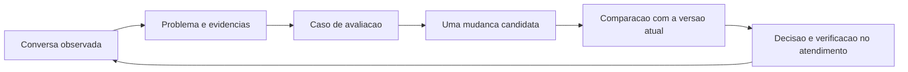

# Curso curto: usar Langfuse para melhorar este RAG e o atendimento N5

Data: 2026-09-09. Estado: plano de ensino, conectado às três fases de implementação; aulas e medições pendentes.

> **Substituído em 2026-09-10 — não seguir este plano como está.** O
> humano decidiu: (1) Langfuse **Cloud**, não self-hosted; (2) a trilha
> de aprendizado deixa de ser um calendário de 6 aulas e passa a ser
> *apprenticeship de diagnóstico* — sessões pareadas sobre conversas
> ruins reais, com o conteúdo conceitual extraído para
> `playbook_diagnostico.md` (a ser escrito). Este documento permanece na
> pasta como registro do desenho original e como fonte do conteúdo do
> playbook (a taxonomia de falha, "o que cada view serve", as
> armadilhas). A autoridade atual é
> [`revisao_claude_code.md`](revisao_claude_code.md); o roteiro técnico
> vigente é a **Fase 0** descrita lá.

## 1. O resultado que vamos construir juntos

Ao terminar, você deverá conseguir abrir uma conversa problemática, localizar a etapa responsável, explicar a evidência que sustenta o diagnóstico, escolher uma mudança e conferir se ela melhorou o atendimento sem criar uma regressão relevante. Eu preparo a parte técnica e guio a investigação; você aprende a interpretar os resultados e decidir o que considera bom para a plataforma.

O curso começa com a sua percepção de que a plataforma está funcionando mal. A leitura do código já aponta lugares que merecem investigação, mas ainda não mede a frequência nem a gravidade dos problemas. Vamos produzir essa fotografia inicial antes de otimizar.

Langfuse registra e apresenta as etapas que instrumentarmos, com entradas, saídas, tempos e consumo. A visibilidade depende dessa cobertura. [Observabilidade e traces](https://langfuse.com/docs/observability/overview).

O ciclo de trabalho será:

O curso curto ensina esse ciclo e acompanha sua primeira aplicação. O refinamento da plataforma continua em ciclos posteriores; o prazo para atingir boa qualidade depende do que os dados revelarem.

## 2. Como as aulas acompanham a implementação

**Duração:** seis aulas, total de 360 minutos, distribuídas conforme as entregas técnicas ficarem disponíveis. Podemos dividir cada aula em blocos menores. Construção da integração, preparação de fixtures, processamento de experimentos e correções maiores têm tempo próprio, fora dessas seis horas.

O ambiente previsto é o checkout atual, aplicação e conhecimento sintético locais, Langfuse self-hosted e atendimento N5 inclusive sem operador conectado. As decisões operacionais estão no [plano de implementação](plano_implementacao_local.md); o curso reutiliza essas decisões.

| Aula | Duração | Entrega técnica necessária | O que você passa a fazer | Resultado registrado |
|---|---:|---|---|---|
| 1. Definir o estado inicial | 45 min | Pode começar antes do Langfuse, junto a P1-01 | Descrever uma falha e definir sucesso observável | Seis casos iniciais e ficha de referência |
| 2. Ler uma conversa por dentro | 60 min | Fase 1 aceita, P1-01 a P1-10 | Percorrer sessão, turno, operações e envio | Três turnos explicados, cobrindo os caminhos N5 |
| 3. Investigar o RAG e o contexto | 60 min | Captura de recuperação/contexto da fase 1 validada | Distinguir conteúdo, busca, seleção e contexto ausente | Hipóteses priorizadas com evidências |
| 4. Definir e medir qualidade | 75 min | Fase 2 aceita, P2-01 a P2-07 | Usar dataset, scores e revisão humana | Baseline dos 30 casos e calibração conferida |
| 5. Testar uma melhoria | 75 min | Runner da fase 2; candidato preparado conforme o SDD aplicável | Comparar versões e examinar regressões | Relatório antes/depois e decisão sustentada |
| 6. Adotar, reverter e manter | 45 min | Fase 3 aceita, P3-01 a P3-06 | Verificar a versão usada e repetir a rotina de melhoria | Exercício de troca/reversão e próxima investigação |
| Laboratório opcional: RAGFlow + Elasticsearch | 90 min | Aula 5; instalação e dados de laboratório verificados | Comparar uma alternativa de recuperação | Parecer sobre benefício, custo e próximo passo |

As tarefas P1 estão no [plano principal, §7](plano_implementacao_local.md#7-ordem-de-implementação-da-fase-1); P2/P3 estão no [detalhamento, §8](detalhamento_execucao.md#8-tarefas-das-fases-2-e-3). Podemos preparar exemplos e rubricas durante o desenvolvimento, mas a prática no painel começa com a entrega correspondente validada.

Cada encontro segue a mesma dinâmica: retomamos o problema, eu mostro um exemplo, você investiga outro com minha orientação e registramos o que aprendeu no [caderno de evolução](caderno_de_evolucao.md). Para assuntos novos, explico primeiro o significado e depois o nome técnico. Os cliques e comandos exatos serão escritos e conferidos na versão instalada durante a preparação da aula.

## 3. O que já sabemos sobre este projeto

Estas são constatações de leitura estática, acompanhadas da investigação que motivam. Não são resultados de um benchmark realizado nesta sessão.

| Constatação no projeto | Pergunta que vamos investigar |
|---|---|
| [`retrieve()`](../app/customer_care/rag/service.py) busca Q&A e filhos clínicos por distância vetorial, mistura os candidatos, limita resultados e expande/deduplica pais | A informação correta existe, foi vetorizada e chegou às primeiras posições? Uma família está ocupando o lugar da outra? |
| [`generate_draft()`](../app/customer_care/ai/router.py) usa `top_k=8`; o primeiro resultado influencia os caminhos clínico e dinâmico | A busca encontrou algo relevante, mas a seleção conduziu a resposta pelo caminho errado? |
| [`_trailing_customer_messages()`](../app/customer_care/ai/router.py) seleciona as mensagens consecutivas do cliente após a última mensagem de outro autor | A informação necessária de um turno anterior chegou ao modelo no turno atual? |
| [`generate_ungoverned_reply()`](../app/customer_care/ai/router.py) reutiliza a seleção anterior; [`generate_ungoverned()`](../app/customer_care/ai/providers.py) recebe histórico e prompt, sem payload de evidências | A resposta livre está sendo cobrada por usar uma informação que não recebeu? |
| [`full_parent_draft()`](../app/customer_care/ai/router.py) pode produzir o texto do documento pai diretamente; `rerank_clinical()` compara um candidato com uma resposta de deflexão clínica | O texto veio de um documento, de um template ou de geração? A troca feita pelo reranking foi adequada? |
| N5 pode reaproveitar `ANSWER`, enviar guided booking ou produzir fallback livre; a decisão governada pode precedê-lo | Qual caminho e mecanismo realmente produziram a mensagem que chegou ao cliente? |
| [`resolve_elapsed_autonomous_sends()`](../app/customer_care/autonomy/service.py) confirma o envio depois da geração; [requisições do cliente](../app/customer_care/anonymous_access/router.py) também movimentam a autonomia | O atraso aconteceu no processamento, no debounce, na janela, no poll ou na exibição pelo navegador? |
| [Casos existentes](../app/scripts/seed_evaluation_cases.py) incluem expectativas antigas de abstenção em agenda; o [registro de estado](../PROJECT_STATE.md) documenta implementações posteriores | Quais exemplos antigos continuam válidos e quais precisam ter a expectativa revista? |

No fallback N5, `status=ANSWER` indica produção de resposta. Precisamos avaliar separadamente sua utilidade e consistência. Similaridade vetorial também não é uma probabilidade de acerto: o limite clínico `0.40` existente tem aplicação específica e não serve como nota universal de qualidade.

## 4. Aula 1 — Definir o estado inicial

**Pergunta central:** o que um atendimento precisa conseguir fazer para você considerá-lo bom?

Eu apresento o mapa da plataforma e preparo a ficha de ambiente: commit, modelos configurados, prompts, referência do conhecimento, configurações de autonomia e data/hora da agenda. Você traz exemplos do uso que o incomodam e descreve o resultado esperado em linguagem comum.

Começaremos com seis cenários. Eles serão incorporados à parte de elaboração do dataset de 30 casos, após revisão; não formam um segundo dataset obrigatório.

| Cenário inicial | O que conferir |
|---|---|
| Pergunta administrativa coberta pelo Q&A | Responder à dúvida usando a informação sintética cadastrada |
| Pergunta sobre um tema presente em documento clínico | Selecionar a fonte pertinente e respeitar o conteúdo aprovado |
| Oferta de consulta seguida de “opção 1” | Manter a opção, profissional, data e preço apresentados |
| Oferta com várias opções seguida de uma escolha em linguagem natural | Entender a escolha ou pedir esclarecimento específico quando ambígua |
| Saudação/solicitação sem evidência suficiente para a tentativa inicial | Observar se ocorre fallback e se ele oferece ajuda útil |
| Conversa com informação importante antes de uma resposta, seguida de “e nesse caso?” | Conferir continuidade e identificar o contexto necessário |

Esses exemplos são pontos de partida. O caminho efetivo depende dos dados e da configuração. Para comprovar os três ramos N5, a preparação técnica também usa fixtures específicas de abstenção e atalho clínico fraco; não vamos rotular uma saudação como fallback sem verificar o trace.

Para cada caso, guardaremos pedido, contexto necessário, expectativa, resposta observada e uma frase sobre o problema. Antes da instrumentação, a causa fica como “a investigar”. Referências de agenda serão as ofertas da fixture/data registrada, sem inventar horários ou preços para o gabarito.

**Você conclui a aula quando:** consegue diferenciar “não houve resposta”, “respondeu com um fato errado” e “respondeu, mas não ajudou”, e há seis casos com critérios verificáveis. A definição inicial de sucesso vai para o caderno antes das primeiras correções.

## 5. Aula 2 — Ler uma conversa por dentro

**Pergunta central:** o que aconteceu entre o pedido e a resposta recebida?

Eu entrego o painel `Atendimento N5` populado e uma conversa de cada caminho. Você abre uma sessão e percorre seus turnos comigo.

| Conceito | Significado no curso |
|---|---|
| Sessão | A conversa completa, agrupada por `conversation_id` |
| Trace | As operações correlacionadas de um turno automático, identificado pela última mensagem do grupo |
| Observação/span | Uma etapa com entrada, saída, duração e resultado |
| Observação de geração | Uma chamada ao modelo no Langfuse; a entidade `AIGeneration` da aplicação também pode representar um resultado determinístico |
| Score | Um valor ou julgamento associado a uma unidade definida, como um turno ou uma sessão |

O mapeamento de IDs e nomes acima segue o [contrato do projeto, §3](detalhamento_execucao.md#3-contrato-de-observações-n5--versão-1). A preparação técnica verifica sua representação no Langfuse instalado.

Roteiro da prática:

1. Filtrar o ambiente `local-n5` e localizar a conversa pelo ID.
2. Abrir o turno e conferir as mensagens selecionadas pelo debounce.
3. Percorrer `rag.retrieve`, chamadas auxiliares, `autonomy.decision` e eventual `ai.n5_free`.
4. Comparar tentativa inicial, saída do provedor e texto de `message.sent`.
5. Conferir mecanismo real, pendência e envio após commit; verificar também a mensagem na tela do cliente.
6. Explicar o tempo gasto em trabalho, esperas e envio, e localizar as chamadas que consumiram tokens.

Envio confirmado no backend e mensagem exibida no navegador são verificações distintas. Um trace sem desfecho pode indicar espera ou perda de telemetria; confirmaremos nos registros transacionais. Custos ausentes ficam como desconhecidos. Não somaremos novamente os tokens de uma chamada já contabilizada.

**Você conclui a aula quando:** explica os três caminhos, identifica qual texto foi enviado e localiza uma espera ou falha sem confundir duração do modelo com o tempo total do atendimento.

## 6. Aula 3 — Investigar o RAG e o contexto

**Pergunta central:** o problema veio da informação disponível, da recuperação ou do uso dessa informação?

Escolhemos uma resposta ruim e uma boa sobre assunto próximo. Você acompanha a pergunta pela busca, pelos resultados ordenados, pela expansão clínica e pelo conteúdo efetivamente fornecido à etapa que respondeu.

| Sinal observado | Conferência prática | Correção candidata, se confirmada |
|---|---|---|
| A referência necessária não existe ou está errada | Ler Q&A/documento e verificar versão/atividade | Curadoria de conteúdo e ingestão dos itens alterados |
| A referência existe, mas não foi indexada corretamente | Conferir hash, embedding, modelo/dimensão e vínculo pai-filho | Corrigir ingestão/indexação e verificar idempotência |
| Referência indexada ausente das primeiras posições | Examinar query, família, ranking e trechos | Experimentar seleção de contexto da query, ranking, limites ou busca híbrida |
| Resultado relevante foi recuperado, mas outro caminho venceu | Comparar ranking, decisão, fontes usadas e texto final | Revisar a seleção/orquestração responsável |
| Modelo recebeu a informação correta e respondeu mal | Ler as mensagens reais do request e a saída correspondente | Experimentar prompt ou modelo dessa etapa |
| Modelo não recebeu o contexto de turno anterior | Comparar sessão completa com `messages` efetivamente enviados | Especificar uma mudança no fornecimento de contexto |
| Oferta/data/preço ficou incorreto | Conferir entrada e saída do resolvedor e IDs das ofertas | Corrigir dados, interpretação ou estado do agendamento |

As candidatas são hipóteses de trabalho. Alterações de recuperação, contexto ou regra de negócio passam pelo SDD próprio antes de código; são diferentes da entrega de instrumentação.

**Primeira investigação proposta:** numa conversa de dois turnos, uma informação necessária foi fornecida antes da resposta anterior. A aplicação pede essa informação outra vez. Conferimos se ela consta do request do segundo turno. Se não constar, o problema já está demonstrado na construção do contexto; um prompt que diga “lembre-se” não acrescenta a informação ausente. Se constar, a hipótese muda para uso do contexto, instrução ou seleção da resposta. Este é um exercício proposto, ainda sem resultado medido.

O reranking clínico atual escolhe entre resposta candidata e deflexão; não devemos confundi-lo com um reranker geral de documentos. Também distinguiremos documentos recuperados de evidências realmente usadas. No fallback livre, recuperar bem na tentativa anterior não comprova que a nova geração recebeu os mesmos dados.

**Você conclui a aula quando:** registra pelo menos duas hipóteses com fonte/trace, uma evidência que poderia refutá-las e um próximo teste. Para lentidão de tela, banco ou infraestrutura, cruzaremos o trace com logs, estado do PostgreSQL e verificação no navegador, conforme a etapa afetada.

## 7. Aula 4 — Definir e medir qualidade

**Pergunta central:** como reconhecer uma resposta boa de forma repetível?

Usaremos o dataset planejado `n5-baseline-v1`: **30 casos, 10 por caminho, sendo 24 para elaboração e 6 reservados para conferência final, dois de cada caminho**. Os casos reservados ficam fora da elaboração de prompts e da calibração inicial. Expectativas antigas de N2 serão revistas antes de reutilização no N5.

Langfuse organiza datasets, execuções de experimentos e scores. No painel, podemos registrar julgamentos humanos; o significado de cada nota vem da nossa rubrica. [Conceitos de avaliação](https://langfuse.com/docs/evaluation/core-concepts), [scores pela interface](https://langfuse.com/docs/evaluation/evaluation-methods/scores-via-ui).

Eu preparo o runner e as referências. Você avalia exemplos antes de consultar a nota do juiz LLM; depois comparamos as avaliações e examinamos as discordâncias. As regras objetivas verificam fatos e IDs. O juiz apoia critérios qualitativos e recebe referências adequadas ao caminho.

| Medida | Regra de leitura |
|---|---|
| Utilidade, continuidade, consistência e clareza | Rubrica existente de 0, 1 ou 2; avaliar cada dimensão separadamente |
| Fatos críticos | `PASS`, `FAIL` ou `NOT_APPLICABLE`; uma falha crítica não é compensada pela média |
| Referência insuficiente para julgar | `INCONCLUSIVE`, com motivo; não vira zero nem aprovação |
| Evidência relevante nas primeiras posições | Nos casos de recuperação com gabarito, verificar presença do Q&A ou pai correto nos primeiros `k` resultados (`Hit@k`) |
| Evidência utilizada | Conferir se a referência encontrada alcançou a decisão/geração e sustentou a resposta; não inferir só da lista recuperada |
| Fallback | Frequência e motivo por decisão N5, separados das falhas anteriores à decisão; ocorrência não é reprovação automática |
| Latência e custo | Mesmo recorte, unidade e configuração; incluir chamadas auxiliares e apresentar consumo desconhecido |
| Resolução/satisfação | Quando houver resposta do usuário, medir na sessão e informar quantas sessões responderam |

Para `Hit@k`, registraremos no `expected_facts` os IDs estáveis de referências pertinentes e usaremos o mesmo `k` entre variantes; o ponto inicial é `k=8`. Só entram no denominador os casos com referência revisada e recuperação aplicável. A taxa é casos com ao menos uma referência pertinente recuperada / casos elegíveis. Quando forem necessárias várias fontes, conferiremos também quais faltaram; acertar uma não prova cobertura completa.

Seguimos a [rubrica e calibração do contrato, §6](detalhamento_execucao.md#6-contrato-de-avaliação-da-fase-2): 12 exemplos humanos com referência suficiente, buscando ao menos 10 concordâncias na classificação aceitável/inaceitável. Esses 12 vêm da parte de elaboração ou de exemplos próprios de calibração. Inconclusivos são informados à parte. A meta calibra a ferramenta neste projeto, sem demonstrar validade geral do juiz.

O relatório inicial mostra contagens por caminho, falhas críticas, notas por critério, inconclusivos, custos e tempos. A amostra pequena serve para diagnóstico e regressão. Percentis como p95 vêm acompanhados do número de observações e são tratados como exploratórios nesse volume.

**Você conclui a aula quando:** justifica uma nota pela rubrica, identifica uma discordância do juiz e lê o relatório sem tratar `ANSWER`, nota automática ou média geral como prova de qualidade.

## 8. Aula 5 — Testar uma melhoria

**Pergunta central:** que evidência permite dizer que esta mudança ajudou?

Escolheremos o problema com maior impacto demonstrado e uma intervenção compatível com sua causa. Para a primeira prática, priorizaremos um candidato pequeno já preparado: conteúdo corrigido, prompt da etapa responsável ou outro ajuste que tenha passado pela especificação aplicável. A duração da aula cobre a análise e o experimento preparado; uma correção estrutural pode exigir trabalho adicional entre encontros.

Eu preparo baseline e candidato com manifesto reproduzível. Você prevê quais casos devem melhorar e quais podem piorar; registramos a previsão antes de comparar.

1. Fixar dataset, código, modelos, prompts, conhecimento, fixtures e data de referência.
2. Declarar a hipótese, a variável principal alterada, os critérios críticos e limites de custo/tempo escolhidos para o uso local.
3. Executar baseline e candidato nos mesmos casos de elaboração, restaurando o estado entre execuções; começar com concorrência 1 e uma repetição.
4. Comparar fatos, qualidade, erros de execução, custo e tempo por caso e por caminho de origem; abrir todos os casos que pioraram.
5. Congelar o candidato antes de consultar os seis casos reservados. Se ajustarmos usando essa reserva, ela passa a ser material conhecido e precisamos de nova reserva para outra conferência independente.
6. Registrar uma decisão: adotar, continuar investigando ou descartar. Se a diferença for ambígua, repetir os casos relevantes e apresentar a variação.

O runner executará o fluxo real da aplicação no banco de testes. Experimentos via SDK permitem usar a lógica da aplicação; uma comparação isolada no playground fica limitada ao prompt executado ali. [Experimentos via SDK](https://langfuse.com/docs/evaluation/experiments/experiments-via-sdk).

Uma mudança que melhora recuperação pode reduzir o uso de fallback. Nessa situação, o caminho do baseline continua como referência para comparar os mesmos casos, e o novo caminho é registrado. A obrigatoriedade de um ramo só é um requisito crítico quando a fixture/regra do caso assim determina; não vamos reprovar uma melhora apenas por mudar a distribuição de caminhos. Essa distinção será formalizada no pacote de avaliação.

**Critério de seleção:** melhora demonstrada no problema alvo, nenhuma nova falha crítica, nenhuma queda não explicada na conferência final e custo/latência apresentados dentro dos limites definidos para o experimento. Seguimos o [contrato de seleção, §6.4](detalhamento_execucao.md#64-aceite-da-ferramenta-e-seleção-de-candidatos). A decisão de uso é sua e fica associada ao relatório; o juiz não promove versões.

**Você conclui a aula quando:** explica por que manter ou rejeitar o candidato apontando casos concretos, incluindo regressões. Um candidato rejeitado com diagnóstico sustentado também é um resultado útil do aprendizado.

## 9. Aula 6 — Adotar, reverter e manter

**Pergunta central:** como colocar uma melhoria em uso e ter certeza de qual versão está respondendo?

Trabalharemos com os quatro prompts previstos: `cc_n5_free`, `cc_rag_answer`, `cc_clinical_rerank` e `cc_date_intent`. O trace identifica qual deles foi executado. Templates de agenda e regras de envio têm seu ciclo de código; não serão editados como prompts.

Você acompanha a sequência publicar candidato → comparar → selecionar versão → atualizar `ativo` → exportar cópia local → conferir nova execução → reverter. As labels `ativo` e `candidato` são escolhas do projeto. Langfuse permite selecionar versões e labels; a versão efetiva precisa ser verificada no trace. [Controle de versões de prompts](https://langfuse.com/docs/prompt-management/features/prompt-version-control).

O TTL inicial planejado é 60 segundos. Após expirar, o cache pode servir a versão anterior durante a atualização. Vamos confirmar a nova versão numa observação posterior e exercitar a recuperação local com Langfuse indisponível, conforme o runbook técnico. [Cache e fallback](https://langfuse.com/docs/prompt-management/features/caching).

Se nenhum candidato tiver sido aprovado, o exercício usa uma versão de demonstração no ambiente de testes. Não é necessário ativar um prompt pior no atendimento para concluir a aula.

**Você conclui a aula quando:** localiza a versão realmente usada, executa a troca/reversão guiada e deixa escolhida a próxima investigação no caderno.

Depois do curso, proponho uma revisão semanal de 30–45 minutos: examinar cinco conversas novas variadas, registrar o problema recorrente mais relevante, adicioná-lo aos casos de elaboração e decidir o próximo experimento. Esse tempo cobre triagem; implementar e avaliar mudanças exige tempo adicional. Quando houver poucas conversas, completar com os cenários sintéticos documentados e identificar essa origem.

## 10. Laboratório opcional — RAGFlow + Elasticsearch

**Pergunta central:** uma alternativa de recuperação resolve uma limitação que os nossos casos demonstraram?

Incluo esta opção porque você informou que já instalou RAGFlow + Elasticsearch. Não encontrei integração desses componentes nas dependências, no Compose ou no caminho de recuperação da aplicação revisados nesta sessão. A preparação confirma versão, engine efetivo, acesso, corpus, modelo de embeddings e recursos disponíveis, sem presumir que instalação equivale a integração.

RAGFlow oferece processamento de documentos e recuperação; seu repositório oficial documenta Elasticsearch como armazenamento de texto e vetores na configuração padrão. Elasticsearch permite combinar busca textual e vetorial. Isso oferece alternativas para testar em casos de vocabulário, termos exatos e ranking. [RAGFlow oficial](https://github.com/infiniflow/ragflow), [busca híbrida no Elasticsearch](https://www.elastic.co/docs/solutions/search/hybrid-search).

| Componente | Papel no laboratório |
|---|---|
| Langfuse | Registrar consultas/resultados instrumentados, scores, tempos e comparações |
| RAG atual em PostgreSQL + pgvector | Baseline medido e candidato a ajustes menores |
| RAGFlow + Elasticsearch instalado | Recuperador candidato, usando uma cópia de laboratório do conhecimento sintético |
| Backend da aplicação | Referência para contexto, agenda, preço, regras e avaliação do atendimento completo |

**Preparação técnica, fora dos 90 minutos:** inventariar a instalação, preparar o corpus e um executor/exportador de resultados. Uma ponte de laboratório precisa de escopo e análise próprios antes de código. O laboratório previsto aqui não constitui migração da plataforma nem autorização de uma nova dependência de atendimento; a necessidade arquitetural será julgada pelas medições, conforme o Artigo VIII da constituição.

Roteiro guiado:

1. Selecionar casos da parte de elaboração em que a busca atual perdeu uma referência existente. Acrescentar controles que o baseline resolve bem.
2. Congelar o corpus sintético, queries e referências. Mapear os resultados de ambos os mecanismos aos mesmos IDs de Q&A/documentos pais, com exposição de fontes preservada.
3. Comparar recuperação atual, um ajuste local pequeno quando pertinente e RAGFlow + Elasticsearch. Usar o mesmo `k`, orçamento de contexto e modelos quando compatíveis; congelar o reranking e a segmentação para isolar a busca quando possível.
4. Quando mudar segmentação, embeddings ou reranker junto com o motor, declarar a comparação entre pipelines completos. Não atribuir o ganho exclusivamente ao Elasticsearch.
5. Medir `Hit@k`, referências necessárias ausentes, ranking, latência e recursos. Scores de cosseno, BM25 e reranking têm escalas diferentes; comparar relevância julgada e posições, sem aplicar o `0.40` atual ao novo mecanismo.
6. Para o candidato promissor, comparar respostas com o mesmo contexto permitido, prompt/modelo e critérios. A etapa seguinte valida o atendimento completo no ambiente de testes, com as fixtures e regras da aplicação.
7. Registrar decisão: continuar refinando pgvector, ampliar o experimento externo ou preparar especificação de uma integração. Uma troca só se justifica com melhora reproduzível nos casos alvo e impacto operacional aceitável.

Uma melhora de busca não corrige, por si só, contexto de conversa ausente, interpretação de oferta ou envio. Também pode não beneficiar o fallback N5 que não recebe o payload recuperado. A medição da resposta completa resolve essa dúvida.

O processamento e a indexação externos podem consumir novos embeddings; seu custo fica separado do atendimento. A preparação mede RAM/CPU/disco com as stacks necessárias. Se não couberem juntas, os candidatos podem ser medidos sequencialmente em condições registradas, sem usar concorrência por memória como evidência de qualidade de recuperação.

**Você conclui o laboratório quando:** explica o que a alternativa melhorou, o que não resolveu e se vale o próximo investimento. Novas ferramentas entram quando respondem a uma hipótese demonstrável.

## 11. Como saber que estamos avançando

| Marco | Evidência de progresso |
|---|---|
| A integração ficou útil | Um turno pode ser explicado até o envio; custos e falhas têm cobertura validada |
| Entendemos o estado inicial | Há casos reproduzíveis, resultados por caminho e problemas priorizados |
| Você aprendeu a diagnosticar | Consegue ligar uma falha a uma etapa e dizer que evidência falta |
| Uma correção melhorou o produto | Comparação controlada sustenta a decisão e a versão em uso foi verificada |
| Criamos uma rotina de evolução | Falhas novas viram casos, candidatos são comparados e mudanças podem ser revertidas |

Integração aceita, curso concluído e plataforma com boa qualidade são marcos diferentes. Aulas 4–6 ensinam a verificar a melhora; não pressupõem que instalar a ferramenta elimine os problemas existentes.

As fontes oficiais foram consultadas em 2026-09-09. O desenho das aulas, os cenários e as metas numéricas são propostas específicas deste projeto. Antes de cada prática, o roteiro será adaptado à versão efetivamente instalada e aos resultados já registrados no caderno.
