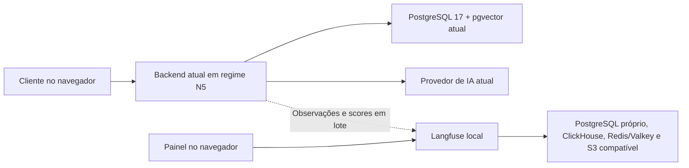

# Plano de implementação local do Langfuse com foco em N5

Criado em 2026-09-08. Revisado em 2026-09-09.

Estado: planejamento pronto para iniciar o desenvolvimento por P1-01, que formaliza e analisa a especificação antes do código. A infraestrutura e a instrumentação ainda não foram implementadas.

Ler em conjunto com [Contratos e roteiro de execução](detalhamento_execucao.md): o complemento define configuração, observações/scores, testes, dataset, rubrica, execução de experimentos, gestão de prompts e tarefas das fases 2 e 3. Os valores operacionais são alvos de implementação a validar, não resultados já medidos.

O [curso prático conectado à implementação](plano_curso_pratico.md) acompanha essas três fases em seis aulas, com diagnóstico inicial, leitura de traces, investigação do RAG/contexto, avaliação, experimento e gestão de versões. O [caderno de evolução](caderno_de_evolucao.md) registra aprendizado e resultados. A prática opcional com RAGFlow + Elasticsearch compara recuperação após o baseline, com preparação própria; não é dependência de conclusão das três fases.

## 1. Decisão e premissas

Implementar Langfuse Open Source self-hosted no checkout atual, junto ao ambiente Docker Compose já utilizado. O regime N5 é o fluxo principal a acompanhar. A fase 1 entrega o acompanhamento de uma resposta automática desde o gatilho até o envio confirmado, com conteúdo, decisões, tokens, custos e tempos no painel.

Premissas definidas pelo usuário:

- Trabalhar diretamente no diretório atual, sem worktree. Usar a aplicação, as portas e a base local já existentes.
- Priorizar o atendimento N5, incluindo operação sem operador conectado. Cobrir tanto respostas reaproveitadas quanto geração de fallback.
- Os dados são simulados. Capturar mensagens, prompts, respostas e evidências no Langfuse local, sem criar uma frente de mascaramento.
- Usar o Langfuse para acompanhar métricas. A duplicação de informações persistidas no PostgreSQL é aceita.
- Minimizar custo financeiro e trabalho operacional. Chamadas adicionais de IA são aceitáveis quando necessárias para validar ou avaliar resultados.
- Executar localmente, sem implantação no Cloud Run nem uso do Langfuse Cloud.
- Entregar uma fase 1 útil por si só e desenvolver avaliação de qualidade e gestão de prompts nas fases seguintes como objetivos importantes da adoção, conforme a prioridade reforçada pelo usuário em 2026-09-09.

Esta revisão substitui a organização do plano anterior. A [avaliação inicial](avaliacao_langfuse.md) permanece como histórico. A auditoria transacional continua atendendo ao contrato existente do projeto; o Langfuse passa a ser a interface cotidiana de observação.

Os recursos centrais da edição Open Source self-hosted são gratuitos, sem franquia de volume. O custo local é o consumo de recursos da máquina e das chamadas ao provedor de IA. Instrumentar uma chamada existente não exige outra chamada ao modelo nem acrescenta tokens ao prompt. [Licenciamento self-hosted](https://langfuse.com/pricing-self-host).

O armazenamento e o painel de observabilidade serão locais. O provedor de IA configurado no projeto continua sendo acessado normalmente.

## 2. O fluxo N5 que precisa ser observado

O código mostra que N5 não corresponde apenas a `generate_ungoverned_reply()`. O sistema primeiro produz uma geração pelo fluxo existente e depois decide como ela será enviada. Em `maybe_open_autonomous_window()`, o ramo N5 possui três resultados principais:

| Caminho | Comportamento existente | Informação necessária no Langfuse |
|---|---|---|
| Reaproveitar resposta | Uma geração `ANSWER` passa pelo critério atual e é enviada sem outra composição livre | Geração inicial, evidências, chamadas realizadas e decisão de reaproveitamento |
| Enviar resultado do agendamento guiado | Um dos gatilhos de guided booking elegíveis é enviado pelo N5 | Ofertas/seleção, interpretação ordinal ou semântica, templates e embeddings utilizados |
| Gerar fallback N5 | A geração inicial não é `ANSWER`, ou é o atalho clínico com score abaixo do limite atual | Motivo do fallback, tentativa inicial, nova geração, prompt N5 e consumo de ambas as etapas |

O N5 compartilha a janela de veto e o resolvedor de envio existentes. A mensagem é criada posteriormente por `resolve_elapsed_autonomous_sends()`, com `autonomous_source=ungoverned_n5`. Registrar apenas a geração perderia o tempo de espera e a confirmação de envio.

O ramo governado é avaliado antes do ramo N5. Registrar as configurações observadas e o mecanismo que efetivamente abriu a pendência, sem classificar todo envio como N5 apenas porque seu switch está ligado. A preferência do usuário orienta filtros e aceite; a instrumentação não altera switches, elegibilidade ou regras de envio.

Conversas sem operador são movimentadas pelas próprias requisições do cliente, incluindo `_drive_unclaimed_autonomy()`. Conversas já assumidas usam os gatilhos associados ao operador e aos heartbeats. Esses pontos também absorvem exceções; observar a falha na etapa onde ela ocorre, mesmo quando a requisição externa termina normalmente.

Referências: [orquestração e decisão N5](../app/customer_care/ai/router.py), [geração pelo provedor](../app/customer_care/ai/providers.py), [requisições do cliente](../app/customer_care/anonymous_access/router.py), [envio autônomo](../app/customer_care/autonomy/service.py), [intervenções do operador](../app/customer_care/operator_workspace/router.py) e [testes sem operador](../app/tests/test_customer_driven_autonomy.py).

## 3. Ambiente local e operação

| Item | Proposta |
|---|---|
| Código | Checkout atual; preservar alterações não relacionadas |
| Compose | Mesmo projeto e `docker-compose.yml`, com serviços adicionais sob o profile `langfuse` |
| Frontend | Endereço atual, normalmente `http://127.0.0.1:5173` |
| Backend | Endereço atual, normalmente `http://127.0.0.1:8000` |
| Banco do atendimento | Instância, volume e porta local atuais; reutilizar a base sintética já vetorizada |
| Painel Langfuse | `http://127.0.0.1:3000`, configurável se houver conflito |
| Endpoint visto pelo backend | `http://langfuse-web:3000` |
| Configuração | Acrescentar variáveis Langfuse ao `.env` existente e documentar em `.env.example` |
| Dados do Langfuse | Volumes próprios, separados das tabelas e do volume do atendimento |

Adicionar Web, Worker, PostgreSQL próprio, ClickHouse, Redis/Valkey e armazenamento S3 compatível. Esses componentes atendem somente ao Langfuse; o backend usa sua API para exportar observações. [Arquitetura self-hosted](https://langfuse.com/self-hosting).

Operação prevista após implementação: `docker compose --profile langfuse up -d --build`. O comando mantém o projeto e os serviços atuais e acrescenta a observabilidade. Usar o mesmo nome de projeto em toda a operação, verificando os volumes existentes antes da primeira inicialização. Documentar parada e retomada dos serviços Langfuse por nome, preservando dados.

A configuração permanece compatível com `docker compose up`; iniciar ou reiniciar o backend não deve depender da disponibilidade do Langfuse. O `.env` local habilita a captura; uma flag permite desligá-la. Publicar o painel em loopback e manter os serviços internos na rede Docker, expondo armazenamento ao navegador apenas se um recurso utilizado exigir.

A base de conhecimento atual evita repetir ingestão e pagar novamente pelos mesmos embeddings. Conferir que a `DATABASE_URL` usada nesta implementação é a do banco local. Não criar outra base cotidiana de atendimento nem mudar as portas existentes para acomodar a observabilidade.

Na leitura de 2026-09-08 foram observados aproximadamente 11 GiB de RAM total, 4,9 GiB disponíveis, 15 GiB de swap e 30 GiB livres no filesystem do repositório. Essa fotografia não é um benchmark. Verificar novamente na execução, incluindo o filesystem usado pelo Docker.

O exemplo de VM da documentação recomenda 4 cores e 16 GiB; essa recomendação não é apresentada como mínimo rígido do teste local. Medir memória, CPU e disco logo ao subir Langfuse junto à aplicação. O novo desenho elimina a duplicação permanente da aplicação, mas os componentes do Langfuse ainda consomem recursos. [Guia Docker Compose](https://langfuse.com/self-hosting/deployment/docker-compose).

## 4. Fase 1 — Acompanhamento do atendimento N5 completo

**Resultado esperado:** abrir uma conversa e responder: o que o cliente enviou, qual caminho foi seguido, por que houve ou não fallback N5, quais chamadas consumiram tokens, qual resposta foi escolhida, quando o envio foi confirmado e onde ocorreu uma falha ou espera.

### 4.1 Preparação e especificação

1. Identificar a base de código, inventariar alterações locais e confirmar serviços e volumes em uso. Trabalhar no checkout atual.
2. Formalizar a fase 1 em pacote próprio, usando `specs/013-local-langfuse-observability/` se o número continuar disponível: spec, plan, tasks, acceptance, analysis e contrato de observações/scores.
3. Ler a constituição e os artefatos ativos e impactados, com prioridade para N5 e suas correções, autonomia, gatilho automático, agenda e RAG. O resumo do AGENTS.md termina antes de várias implementações presentes; registrar e resolver divergências antes do código, preservando decisões autorizadas.
4. Registrar nos artefatos de maior autoridade a justificativa dos serviços locais do Langfuse: acompanhamento atualmente ausente do fluxo N5 e de seu consumo completo. A restrição a infraestrutura distribuída precisa estar coerente com essa adoção, limitada à observabilidade local.
5. Executar revisão de consistência spec → plan → tasks → aceitação antes da implementação. A API pública de atendimento não precisa de novos endpoints.

### 4.2 Stack e adaptador

- Fixar versões exatas compatíveis do servidor, SDK e imagens auxiliares. A documentação consultada em 2026-09-08 apresentava servidor e SDK Python v4; validar o conjunto escolhido com Python 3.12 e `openai==1.102.0` antes de congelá-lo. [Compatibilidade](https://langfuse.com/docs/compatibility).
- Configurar o profile local, healthchecks dos serviços Langfuse e inicialização idempotente de usuário, organização, projeto e chaves. [Inicialização oficial](https://langfuse.com/self-hosting/administration/headless-initialization).
- Desligar a telemetria de uso da plataforma com `TELEMETRY_ENABLED=false` nos serviços Langfuse. [Telemetria](https://langfuse.com/self-hosting/security/telemetry).
- Criar um adaptador pequeno em `shared`/`infrastructure`, com inicialização por processo, observações, scores e implementação inerte quando desabilitado. Capturar 100% das operações relevantes ao atendimento local.
- Usar payloads explícitos com conteúdo funcional: mensagens selecionadas, prompts completos, respostas, parâmetros, decisões e evidências. Credenciais e objetos de sessão HTTP/SQL ficam fora da serialização. Não adicionar mascaramento nem desfazer as regras de armazenamento já existentes.
- Preservar a exclusão de raciocínio interno. Contagens de reasoning tokens, quando retornadas, são metadados de consumo.
- Exportar em lote, sem requisições de rede dentro de transações de atendimento. Configuração ausente, falha do SDK ou Langfuse indisponível não podem impedir atendimento manual nem o fluxo N5 existente.
- Fazer flush com prazo limitado no encerramento normal e nos comandos curtos. A entrega é de melhor esforço: quedas abruptas podem perder observações pendentes. Não repetir chamadas de IA para reconstruir um trace perdido.

### 4.3 Instrumentação orientada ao turno automático

Um **turno automático** é o grupo de mensagens que o debounce existente selecionou para responder. Não assumir uma geração por mensagem digitada: várias mensagens podem formar um único turno.

| Etapa | Captura obrigatória na fase 1 |
|---|---|
| Recebimento e gatilho | Mensagens do turno, mensagem mais recente, origem do acionamento, conversa com/sem operador, tempos e configuração de debounce |
| Geração inicial | RAG, caminhos determinísticos, composição, reranking e resultado da primeira tentativa |
| Decisão de envio | Caminho N5 escolhido, motivo do fallback, gatilho, mecanismo efetivo e configurações relevantes |
| Fallback N5 | Prompt próprio, histórico recebido, resposta, modelo, uso, erro e vínculo com a geração anterior |
| Agendamento no N5 | Consulta de agenda/preço, interpretação de datas, ofertas, escolha ordinal/semântica e resultados determinísticos elegíveis |
| Janela de veto | ID da pendência, abertura, duração configurada e instante previsto de resolução |
| Resolução | Estado confirmado: `SENT`, `PAUSED`, `EDITED` ou `TAKEN_OVER`; pendências não resolvidas continuam `PENDING` |
| Envio confirmado | ID e texto da mensagem persistida, geração de origem, `autonomous_source` e confirmação após commit bem-sucedido |
| Falha | Etapa, classe de erro e correlação, incluindo exceções absorvidas pelos gatilhos/polls |

**N5 sem operador conectado é o roteiro principal de aceite.** A instrumentação deve acompanhar requisições do cliente, sem depender de alguém abrir a fila do operador para gerar dados de observabilidade.

Observar trabalho efetivo e transições. Polls sem mudança não produzem novos traces de IA nem scores repetidos. Falhas existentes serão mostradas como falhas; a integração não deve inventar um mecanismo de fallback ou envio para corrigi-las.

### 4.4 Provedores, RAG e contabilização

Instrumentar todas as chamadas de `OpenAIGenerationProvider` e `OpenAIEmbeddingProvider` que alimentam o fluxo. Isso inclui `generate`, `rerank_clinical`, `extract_date_intent`, `generate_ungoverned` e embeddings de busca, apresentação e escolha de horários. Coletar uso na fronteira do provedor, antes de convertê-lo para os retornos atuais do domínio.

Usar o wrapper oficial para chat completions, com observações da aplicação ao redor. Para embeddings, capturar uso explicitamente; não depender de cobertura implícita do wrapper. Garantir uma observação de consumo por chamada, sem sobrepor contabilização automática e manual. [Integração Python](https://langfuse.com/integrations/model-providers/openai-py).

Registrar ranking e scores das buscas administrativa/clínica, expansão do filho ao pai e snapshot das evidências recuperadas e usadas. Mostrar a resposta antes e depois do reranking. No fallback N5, distinguir a evidência da tentativa anterior do conteúdo efetivamente enviado ao gerador livre, que não recebe aquele payload de evidências.

Embeddings no recebimento da mensagem podem anteceder a geração automática. Correlacioná-los à mensagem e à sessão, incluindo-os no custo da conversa. Arrays numéricos dos vetores não precisam ser armazenados no Langfuse; textos, dimensão, modelo e quantidade bastam para o diagnóstico.

Regras de custo:

- Capturar modelo solicitado/retornado e uso reportado pelo provedor, inclusive detalhes de cache/reasoning disponíveis.
- Somar chamadas pagas uma única vez. Não copiar consumo da tentativa inicial para o fallback nem duplicá-lo na observação da operação completa.
- Uma resposta de agenda ou documento clínico pode não ter composição por LLM; seus embeddings e chamadas auxiliares continuam contabilizados.
- Falha sem metadados de uso representa consumo desconhecido, não custo comprovadamente zero.
- Validar o cadastro de preços dos modelos e registrar referência/data quando configurar preços manualmente. Valores exibidos são estimativas, não equivalência garantida da fatura.
- Separar atendimento, ingestão, testes e avaliações. O adaptador cobre também embeddings de ingestão/CRUD quando executados; acompanhamento administrativo detalhado desses fluxos não bloqueia o aceite N5.

Esses critérios seguem as possibilidades e limites do [rastreamento de tokens e custos](https://langfuse.com/docs/observability/features/token-and-cost-tracking).

### 4.5 Correlação entre requisições

- `session_id = conversation_id` reúne toda a conversa.
- `turn_id = triggering_message_id` identifica o último item do grupo selecionado pelo gatilho. Usar seu UUID sem hífens como `trace_id` do turno N5. Não usar apenas o ID da requisição HTTP como identidade da resposta.
- Geração inicial e eventual fallback são observações do mesmo turno, identificadas por `ai_generation_id` e `prior_generation_id` quando persistidas. Uma falha anterior à persistência permanece visível como tentativa técnica sem entidade criada.
- Guardar os IDs de todas as mensagens selecionadas. Operações anteriores sobre outra mensagem do grupo podem ter trace próprio; relacioná-las sem reenviar observações já contabilizadas.
- O envio posterior recupera o turno pela geração de origem e publica sua própria observação curta. Para idempotência dos scores, preservar ID determinístico, nome e timestamp original em UTC, derivados dos registros existentes; não depender de mapas somente em memória. O contrato exato está no [detalhamento, §3.4](detalhamento_execucao.md#34-scores-e-deduplicação).
- Publicar abertura/resolução de pendência e envio confirmado apenas após os respectivos commits. Uma mensagem persistida significa envio confirmado no backend; não prova que o navegador já a exibiu.
- Não manter spans abertos esperando debounce, janela ou próximo poll. Registrar timestamps disponíveis e calcular separadamente os intervalos de espera.
- Registrar ambiente, commit, versão do prompt, categoria quando aplicável, caminho N5, mecanismo real, configurações de autonomia e origem do gatilho. `effective_mode=N2` é a representação técnica usada pelo código também no regime N5; não filtrar N5 procurando um valor `N5` inexistente nesse campo.
- Testar contexto nas rotas síncronas e concorrência entre conversas. Custos de chamadas distintas realmente executadas não devem desaparecer por deduplicação de eventos.

Essa correlação aproveita os IDs existentes; não prevê migração de schema na fase 1. Uma necessidade demonstrada exige atualização do pacote SDD antes de prosseguir. Langfuse aceita IDs de trace de 32 caracteres hexadecimais e scores vinculados por ID. [IDs](https://langfuse.com/docs/observability/features/trace-ids-and-distributed-tracing), [scores](https://langfuse.com/docs/evaluation/evaluation-methods/scores-via-sdk).

Coleta prospectiva: começar com novas execuções. Não reconstruir consumo histórico ausente nem exigir apagar as conversas atuais para iniciar a observabilidade.

### 4.6 Dashboard `Atendimento N5`

Entregar o painel já configurado e populado, com configuração exportada ou receita reproduzível. A interface do atendimento não precisa ganhar uma tela de métricas. [Dashboards](https://langfuse.com/docs/metrics/features/custom-dashboards).

| Indicador | Definição/recorte |
|---|---|
| Turnos iniciados e envios N5 | Turnos identificados pelo gatilho e mensagens confirmadas com `autonomous_source=ungoverned_n5`; contagens separadas |
| Caminho escolhido | Reaproveitamento de `ANSWER`, guided booking e fallback livre; mecanismo governado separado se ocorrer |
| Frequência de fallback | Turnos que iniciaram `generate_ungoverned_reply()` / turnos que chegaram à decisão N5; falha ao gerar o fallback continua incluída no numerador |
| Motivo do fallback | Status anterior e condição clínica de baixa relevância; abstenção inicial não significa ausência de resposta final |
| Tokens e custo | Chamadas por etapa/modelo e totais por conversa, incluindo tentativa inicial e fallback quando executado |
| Tempo de processamento | p50/p95 da operação ativa `n5.process_turn`, recuperação e chamadas; inclui decisão/fallback, exclui esperas entre requisições |
| Tempo até envio no backend | Timestamp da mensagem enviada menos timestamp da mensagem mais recente do grupo respondido; inclui debounce, processamento e espera efetiva pela resolução |
| Janela e atraso de resolução | Duração configurada, `opens_at`, `resolves_at` e `resolved_at`; atraso de resolução separado do tempo do LLM |
| Falhas por etapa | Recuperação, composição, fallback ou envio; incluir turno que falhou antes de criar pendência |
| Abertura e desfecho da pendência | Abertura e resolução confirmadas em eventos separados; desfechos `SENT`, `PAUSED`, `EDITED`, `TAKEN_OVER`; ausência de resolução significa sem desfecho observado |

Emitir scores de caminho/fallback por turno elegível, de abertura por pendência e de desfecho somente após resolução confirmada. Abertura e desfecho usam nomes/IDs diferentes para impedir que uma abertura entregue com atraso sobrescreva uma resolução. Reapresentações preservam ID, nome e timestamp original e não aumentam contagens. A entrega é de melhor esforço: ausência de desfecho pode ser espera ou perda de telemetria, portanto não equivale a falha definitiva nem fornece uma contagem autoritativa de pendências atuais.

Filtros iniciais: ambiente, período, sessão, caminho N5, motivo do fallback, modelo, versão do prompt, commit e gatilho. Priorizar informações que explicam respostas automáticas. Taxa de aprovação/edição de rascunho não é indicador central da fase 1, pois o uso principal não envolve aprovação humana por resposta.

### 4.7 Aceite da fase 1

| Cenário | Evidência exigida |
|---|---|
| N5 sem operador conectado | Cliente recebe resposta; trace mostra acionamento pelo cliente, caminho e mensagem confirmada |
| `ANSWER` reaproveitado | Mesmo texto e geração seguem para envio; nenhuma chamada fictícia ao gerador livre |
| Agendamento guiado | Oferta, escolha ordinal/semântica e etapas elegíveis observáveis; tokens somente nas chamadas executadas |
| Abstenção inicial | Tentativa inicial e fallback no mesmo turno; saída final não classificada como abstenção apenas pelo primeiro resultado |
| Atalho clínico fraco | Motivo específico do fallback, score e limite usados pela decisão existente |
| Janela zero e positiva | Envio e tempos corretos nos dois casos, sem mudar a configuração de uso cotidiano |
| Reinício entre geração e envio | Pendência e mensagem continuam correlacionadas após reiniciar o backend |
| Pausa, edição ou tomada de controle | Estado final observável e ausência de envio indevido; regressão mesmo sendo uso eventual |
| Erro no fallback | Erro visível mesmo se o gatilho absorver a exceção; sem score de envio bem-sucedido |
| Langfuse parado | Fluxo N5 e atendimento manual funcionam; exportação não prende transações |
| Polls repetidos e concorrência | Sem eventos repetidos por poll, mistura de sessões ou duplicação de mensagem confirmada |
| Rollback do envio | Não exportar mensagem como confirmada nem atualizar estado para `SENT` |
| Custos | Uso real presente uma vez; geração sem LLM e uso desconhecido representados corretamente |
| Recursos locais | Medição com aplicação + Langfuse registrada, sem OOM ou crescimento contínuo de filas no roteiro |

Executar gates existentes de backend (ruff, mypy, unitários, integração PostgreSQL, API/OpenAPI), frontend (lint, tipos, componentes, build), E2E, grounding, expansão pai-filho, idempotência e negativos aplicáveis. Manter seis abas/quatro ativas como regressão de capacidade; o roteiro principal de observabilidade é N5 sem operador, que não exige claim de quatro conversas.

Usar testes determinísticos para invariantes e um conjunto pequeno de chamadas reais para validar captura, custo e conteúdo no painel. Fluxos manuais permanecem cobertos por regressão, mas sua instrumentação específica e dashboards próprios não são requisito de conclusão desta fase.

Os E2E atuais incluem `TRUNCATE` e mudanças de configuração. Preparar banco de testes descartável no PostgreSQL local e execução automatizada que aponte backend, testes e helpers SQL ao mesmo destino de teste, retomando a configuração normal ao final. Isso é isolamento de dados durante testes no mesmo checkout, sem segunda instalação cotidiana da aplicação. Não executar resets contra a base usada pelo usuário. Reutilizar portas e projeto atuais; adaptar somente os helpers necessários à seleção do banco e propagação da configuração de teste. Manter o worker único da suíte.

Verificar registros pela API e pela interface do Langfuse, esperando ingestão assíncrona com timeout finito. No E2E, validar também que a mensagem aparece no cliente; o dashboard mede confirmação no backend, sem alegar medição de renderização no navegador.

**Concluir a fase 1 somente com painel N5 populado, três caminhos demonstrados, envio correlacionado e revisão spec-to-code registrada. Essa entrega já pode ser usada continuamente sem executar as fases seguintes.**

## 5. Fase 2 — Qualidade das respostas no N5

Esta fase é parte do resultado pretendido da adoção. Depende da coleta da fase 1 e de especificação própria para avaliação automatizada, pois os casos existentes foram definidos como revisão manual.

### 5.1 Benefícios esperados e decisões que passam a ser possíveis

No código atual, `generate_ungoverned_reply()` persiste `status=ANSWER`. Esse estado comprova que uma resposta foi produzida, mas não que ela respondeu bem à solicitação. O cadastro atual de casos trabalha principalmente com status esperado, evidências e notas manuais. O ganho é acrescentar critérios que avaliem o conteúdo e a progressão do atendimento.

| Benefício | Exemplo no projeto | Decisão apoiada |
|---|---|---|
| Encontrar respostas tecnicamente bem-sucedidas, mas pouco úteis | N5 responde com uma oferta genérica de ajuda a uma dúvida já específica | Ajustar instrução, contexto fornecido ou informação disponível |
| Entender a qualidade por caminho | Respostas de agenda podem ir bem enquanto o fallback livre repete frases | Concentrar mudanças na etapa responsável |
| Evitar regressões ao mudar prompts | Uma orientação para ser mais breve pode omitir o próximo passo do agendamento | Comparar a versão candidata com a atual antes de ativá-la |
| Identificar falta de contexto | A resposta pede novamente uma informação que o cliente já forneceu | Verificar se a informação chegou ao modelo antes de tentar corrigir apenas o prompt |
| Comparar qualidade e custo conjuntamente | Um modelo ou prompt muda a qualidade, o tamanho das respostas e o consumo total do turno | Escolher a configuração que atende aos critérios com custo aceitável |
| Transformar problemas de uso em verificações permanentes | Um caso de escolha de horário falha durante uma demonstração | Incorporá-lo ao dataset para detectar recorrência |

Esses resultados dependem de instrumentação, casos e critérios definidos para a aplicação. Instalar o Langfuse não produz automaticamente uma medida confiável de qualidade.

### 5.2 Critérios por caminho N5

| Critério | O que verificar | Forma de avaliação inicial |
|---|---|---|
| Relevância e utilidade | A resposta trata da solicitação concreta e oferece uma ação ou esclarecimento útil | Revisão humana e avaliador por LLM com rubrica curta |
| Continuidade | Considera o contexto disponível, evita contradições e perguntas repetidas desnecessárias | Casos com múltiplas mensagens e avaliação da sequência |
| Consistência com dados simulados | Não altera preço, profissional, horário ou informação que consta da referência do caso | Regras sobre resultados estruturados e conferência com fixtures |
| Correção do agendamento | A opção interpretada e os dados apresentados correspondem às ofertas do cenário | Verificações determinísticas sobre IDs e parâmetros |
| Aderência à evidência | Afirmações do caminho fundamentado correspondem à evidência fornecida | Referência revisada, verificações específicas e LLM quando necessário |
| Qualidade do fallback livre | A resposta ajuda sem inventar detalhes específicos que não recebeu | Rubrica própria do N5 livre, com exemplos de respostas boas e ruins |
| Clareza e concisão | Texto compreensível, proporcional à dúvida, sem repetições ou instruções internas | Avaliação qualitativa; tamanho como sinal auxiliar |

Não aplicar exigência universal de citações ou evidência recuperada a todos os caminhos. O fallback N5 tem outra finalidade. Também não considerar resposta curta automaticamente boa, fallback automaticamente ruim ou envio bem-sucedido prova de resolução do pedido.

Quando faltar uma referência necessária para julgar um fato, registrar avaliação inconclusiva, em vez de pedir ao avaliador que adivinhe a informação correta. Satisfação e resolução declaradas pelo usuário pertencem à sessão; não replicar uma nota em cada geração.

### 5.3 Experimentos e acompanhamento durante o uso

Criar o dataset inicial `n5-baseline-v1` com 30 casos, 10 por caminho: 24 para elaboração/comparação e 6 para conferência final, sendo 2 de cada caminho nessa reserva. Incluir continuidade, mensagens agrupadas, agenda, datas, escolha semântica, abstenção inicial e atalho clínico fraco. Cada caso precisa de entrada/contexto e critérios de sucesso; não exigir uma frase exata quando várias respostas são aceitáveis. O [contrato de avaliação](detalhamento_execucao.md#6-contrato-de-avaliação-da-fase-2) define JSONL, fixtures, rubrica, calibração, isolamento das variantes e manifesto reproduzível.

Combinar duas rotinas: comparar alterações sobre casos fixos e avaliar uma seleção de conversas novas do uso local. Problemas encontrados nessa seleção alimentam os testes seguintes. Langfuse permite organizar datasets, experimentos e scores para essas duas rotinas. [Conceitos de avaliação](https://langfuse.com/docs/evaluation/core-concepts).

Para uma comparação útil:

1. Fixar versões de prompts, modelo, configuração, código, evidências e data de referência da agenda.
2. Executar a configuração atual e a candidata sobre os mesmos casos, alterando uma variável principal por vez.
3. Comparar resultados por caminho e critério, junto aos custos e tempos; não depender apenas de uma média geral.
4. Examinar os casos que pioraram. Repetir casos ambíguos quando a variação do modelo puder explicar a diferença.
5. Reservar alguns casos para a conferência final, evitando ajustar o prompt apenas aos exemplos utilizados durante sua elaboração.

Uma coleção pequena identifica regressões concretas e serve como ponto de partida. Não comprova, sozinha, uma taxa geral de acerto para todas as conversas futuras.

O experimento de um turno N5 completo deve executar a orquestração da aplicação no ambiente de testes, incluindo recuperação, decisão, agenda e fallback. Um teste isolado de prompt no playground ajuda a comparar sua redação, mas não valida os outros componentes do atendimento.

### 5.4 Como manter custo e esforço controlados

- Usar regras para resultados objetivos, sem chamada adicional de IA.
- Começar com um avaliador por LLM e poucos critérios claros, aplicado sob demanda a uma seleção de respostas. Esse avaliador recebe entrada, saída e referências pertinentes e produz scores conforme a rubrica. [LLM-as-a-Judge](https://langfuse.com/docs/evaluation/evaluation-methods/llm-as-a-judge).
- Conferir uma amostra manualmente e ajustar o avaliador quando discordar por razões inadequadas. Versionar a rubrica e o modelo avaliador; a nota automática é um sinal, não uma verdade garantida.
- Avaliar snapshots existentes quando a pergunta for sobre respostas já produzidas. Gerar novas respostas somente quando o experimento precisar comparar configurações.
- Limitar casos e repetições por execução; registrar custo de avaliação separado do atendimento.
- Usar banco de testes para experiências que alterem conversas ou agenda. A avaliação não participa do caminho de autorização do envio ao cliente.

Aceite: comparar duas versões sobre os mesmos casos, mostrar melhorias/regressões por caminho N5, conferir a calibração dos julgamentos e consultar custo da execução. O detalhamento distingue aceitar a ferramenta de avaliação de aprovar a qualidade de um candidato: problemas já existentes podem ser encontrados sem impedir a entrega da ferramenta. Os resultados apoiam decisão humana, sem ajustar automaticamente as políticas.

Instrumentação administrativa detalhada de ingestão/CRUD, busca manual, rascunhos manuais e métricas de aprovação/edição pode ser acrescentada se esses fluxos voltarem a ser usados. Não é dependência para acompanhar ou avaliar N5.

## 6. Fase 3 — Gestão dos prompts utilizados pelo N5

Esta fase também integra o resultado pretendido. A coleta prepara a rastreabilidade; a avaliação fornece os critérios para escolher versões. Especificar a mudança de carregamento antes da implementação.

### 6.1 O que será gerenciado

O projeto já tem versionamento por hash para os arquivos carregados por `load_prompt()` e para a constante N5. Langfuse acrescenta organização, comparação e associação das versões aos resultados, além da possibilidade de edição pelo painel.

| Prompt/instrução atual | Papel no N5 | Ganho com gestão explícita |
|---|---|---|
| `UNGOVERNED_N5_SYSTEM_PROMPT`, em `ai/providers.py` | Orienta a resposta livre de fallback | Experimentar utilidade, estilo e próximos passos sem perder o histórico da versão |
| `prompts/rag_answer.md` | Compõe respostas da tentativa inicial que o N5 pode reaproveitar | Medir se uma mudança melhora essas respostas e altera a necessidade de fallback |
| `_RERANK_SYSTEM_PROMPT_TEMPLATE`, em `ai/providers.py` | Compara a resposta candidata com a deflexão clínica | Investigar trocas indevidas de resposta e testar instruções mais adequadas |
| `prompts/date_intent.md` | Interpreta expressões de data e horário | Comparar acerto em casos como dia da semana, período e referência relativa |
| `FORMAT_INSTRUCTION` e montagem das mensagens | Completam o pedido enviado ao provedor | Rastrear o prompt efetivo; o hash do arquivo principal não descreve sozinho toda a instrução enviada |

Gerenciar os prompts realmente utilizados, preservando os contratos estruturais validados pelos parsers. Registrar também mensagens renderizadas, variáveis e versão do código. Não transformar políticas de envio, templates determinísticos ou regras de agenda em instruções editáveis de um LLM.

### 6.2 Benefícios concretos

- **Iteração mais rápida:** após integrar o carregamento, editar prompts pelo painel e testar candidatos. Isso é especialmente útil para instruções hoje embutidas em Python, que normalmente exigem atualizar/reiniciar o backend para mudar.
- **Comparação com evidências:** relacionar cada versão às respostas, scores, custo e latência observados. A mudança passa a ter um resultado verificável por caminho N5. [Gestão de prompts](https://langfuse.com/docs/prompt-management/overview).
- **Separação entre versão em teste e em uso:** usar labels como `candidato` e `ativo` para selecionar a versão desejada. Mudar a label permite voltar a uma versão anterior sem reconstruir o texto de memória. [Versões e labels](https://langfuse.com/docs/prompt-management/features/prompt-version-control).
- **Diagnóstico mais preciso:** identificar a combinação de versões da tentativa inicial, reranking, data e fallback responsável por um comportamento. Editar o prompt livre não altera uma resposta enviada diretamente pelo caminho de agenda.
- **Menos perda de aprendizado:** preservar versões que funcionaram, experimentos e casos que motivaram cada alteração.

### 6.3 Fluxo de alteração proposto

1. Encontrar um problema recorrente nas conversas observadas, como respostas de fallback que não oferecem um próximo passo útil.
2. Conferir o trace e identificar o prompt realmente executado. Se a causa for contexto ausente, dado incorreto ou lógica de seleção, registrar a correção na parte correspondente.
3. Criar uma versão candidata do prompt e explicar brevemente o objetivo da alteração.
4. Executar os casos da fase 2 com versões fixas. Conferir também casos não relacionados ao problema original para procurar regressões.
5. Comparar qualidade, custo e tempo; selecionar explicitamente a versão a usar.
6. Verificar em novas observações que o backend passou a usar a versão selecionada. Se houver regressão, retornar à anterior.

Editar um prompt no painel só muda o atendimento depois que o backend estiver integrado ao carregamento desse prompt. Cache também pode adiar a adoção da nova versão. Documentar prazo de atualização e registrar a versão efetiva, incluindo quando foi usado fallback local. O SDK oferece cache e possibilidade de prompt de fallback; a integração deve validar esse comportamento com Langfuse indisponível. [Cache e fallback](https://langfuse.com/docs/prompt-management/features/caching).

Manter uma cópia exportada/versionada dos prompts ativos e o procedimento de reversão, para preservar as decisões mesmo se os volumes locais do Langfuse forem recriados. A promoção de prompt continua sujeita aos contratos do projeto; melhorias de redação não autorizam novos comportamentos de negócio.

O [contrato de prompts](detalhamento_execucao.md#7-contrato-de-prompts-da-fase-3) fixa os quatro nomes lógicos, a fronteira de carregamento, o TTL inicial de 60 s, os prazos de busca, a cópia local de recuperação e a sequência publicar → comparar → ativar → exportar → verificar → reverter. Experimentos usam versões fixas; cada turno registra o conjunto efetivamente resolvido.

Aceite: uma versão candidata pode ser comparada à atual, selecionada e revertida, com resultados e versões identificáveis. A aplicação continua atendendo com a versão de fallback documentada quando necessário.

### 6.4 Benefício combinado das três fases

O ciclo pretendido é: **conversa observada → problema identificado → caso de avaliação → prompt candidato → comparação → versão selecionada → novas conversas observadas**.

No N5, esse ciclo reduz a dependência de revisão prévia pelo operador: problemas podem ser identificados após as conversas e usados para melhorar os próximos atendimentos. O ganho esperado é evolução mensurável da qualidade, com capacidade de investigar e reverter mudanças. A instalação da ferramenta não garante melhora automática; o resultado depende da execução desse ciclo.

Nas fases 1 e 2, os prompts continuam em arquivos/código, com conteúdo e versão registrados. Isso prepara a fase 3 sem interromper o uso da primeira entrega.

## 7. Ordem de implementação da fase 1

| Passo | Trabalho | Dependência |
|---|---|---|
| P1-01 | Inventário no checkout atual e especificação N5 analisada | Base identificada |
| P1-02 | Profile Langfuse no Compose atual, inicialização e medição de recursos | P1-01 |
| P1-03 | Destino descartável para testes e helpers consistentes | P1-01 |
| P1-04 | Adaptador, configuração, ciclo de vida e correlação de turno | P1-02 |
| P1-05 | Captura de geração/embeddings e consumo | P1-04 |
| P1-06 | Gatilho, tentativa inicial, decisão e três caminhos N5 | P1-05 |
| P1-07 | Janela, envio confirmado, estados e correlação entre requisições | P1-06 |
| P1-08 | Dashboard `Atendimento N5`, filtros e roteiro demonstrativo | P1-07 |
| P1-09 | Gates e aceite com Langfuse ligado/desligado e sem operador | P1-03 e P1-08 |
| P1-10 | Convergência, runbook e evidências de encerramento | P1-09 |

O ganho inicial vem da visibilidade do atendimento que já ocorre, sem adicionar uma chamada de avaliação a cada resposta. A fase 1 não depende de gestão remota de prompts nem de painel de produtividade do operador.

As [tarefas das fases 2 e 3](detalhamento_execucao.md#8-tarefas-das-fases-2-e-3) completam a sequência com dependências e critérios de fechamento. O mesmo complemento especifica os widgets, os testes de falha e os alvos operacionais usados no aceite da fase 1.

## 8. Arquivos e entregáveis previstos

| Área | Arquivos existentes ou propostos |
|---|---|
| SDD | Novo pacote da fase 1 e atualização coerente dos documentos de autoridade/observabilidade impactados |
| Ambiente | `docker-compose.yml` com profile, `.env.example`, variáveis no `.env` local e runbook em `LANGFUSE/` |
| Dependências | `app/requirements.txt` com SDK validado e versão fixada |
| Integração | Adaptador em `shared`/`infrastructure`, settings e `bootstrap.py` |
| IA e RAG | `ai/providers.py`, `ai/router.py`, `knowledge/embeddings.py`, `rag/service.py` |
| Agenda | Pontos de `scheduling/availability.py` e `scheduling/guided_booking.py` utilizados pelo fluxo |
| Gatilho e envio | `anonymous_access/router.py`, `autonomy/service.py` e pontos de decisão/intervenção de `operator_workspace/router.py` |
| Painel | Configuração ou receita reproduzível do dashboard N5 e catálogo de observações/scores |
| Validação | Testes da integração, smoke N5 sem operador, regressões e helpers para banco de testes |
| Avaliação — fase 2 | Dataset JSONL e fixtures versionadas, executor de cenários/snapshots, manifestos e relatório comparativo |
| Prompts — fases 2/3 | Fronteira de resolução local para experimentos; catálogo, adaptador Langfuse, snapshots e comandos de ativação/reversão na fase 3 |
| Aprendizado | Curso de seis aulas, caderno de evolução e roteiros guiados preparados conforme a entrega de cada fase |

Não se prevê migração de schema para observabilidade. Qualquer necessidade demonstrada deve passar por spec → plan → tasks → analysis; migrations já aplicadas não serão editadas.

As fontes técnicas de infraestrutura foram consultadas em 2026-09-08. A revisão de 2026-09-09 ajusta o ambiente e a prioridade N5, aprofunda avaliação/gestão de prompts e verifica compatibilidade, atualização de scores e cache na documentação atual, com inspeção dos caminhos no código. Validar versões e consumo efetivo ao iniciar a implementação.

**Prontidão:** o plano e seu complemento resolvem as decisões necessárias para começar por P1-01. A formalização SDD, a prova de compatibilidade, os testes e as medições continuam como tarefas de desenvolvimento; não exigem outra rodada de planejamento conceitual antes de iniciar.
