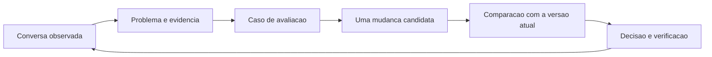

# Playbook de diagnóstico — Langfuse aplicado a esta plataforma

Criado em 2026-09-10 a partir do conteúdo conceitual de
`plano_curso_pratico.md` (que fica na pasta como registro do desenho
original). Autoridade: `revisao_claude_code.md`. Roteiro técnico:
`plano_implementacao.md`.

## Como usar

Isto é **referência, não currículo**. O aprendizado acontece em sessões
pareadas sobre conversas ruins reais: pega-se um caso, abre-se o trace, e
o significado de cada coisa é explicado naquele contexto. Cada sessão
termina com um modo de falha diagnosticado ou uma correção testada.
Achados vão para o `caderno_de_evolucao.md`. As seções abaixo crescem à
medida que a prática bate em cada recurso do Langfuse.

## O ciclo

Diagnosticar **antes** de mexer em prompt. Um prompt que diz "lembre-se"
não acrescenta uma informação que não chegou ao modelo.

## Taxonomia de falha

Toda resposta ruim cai em uma (ou mais) destas camadas. A ordem é a ordem
de investigação.

### 1. Conteúdo
- **Cara:** resposta errada porque a informação certa não existe, está
  desatualizada ou foi desativada.
- **Conferir:** ler o Q&A / documento clínico; checar `is_active`,
  `content_hash`, `embedding_model`.
- **Correção:** curadoria + reingestão (`DOCS_PESSOAIS/PROCESSO_RAG.md`).
  Fora do escopo de instrumentação.

### 2. Recuperação
- **Cara:** a informação existe mas não chega às primeiras posições, ou
  uma família (Q&A × clínico) ocupa o lugar da outra.
- **Conferir no trace:** span `rag.retrieve` — a **query exata embedada**,
  os hits ordenados, o score de cada um, o rank do documento certo.
  `retrieve()` mistura Q&A e clínico por distância, dedupa pais, corta em
  `top_k=8`.
- **Correção candidata:** embedar só a última mensagem em vez do blob
  concatenado; hybrid search (`tsvector`); rerank; **depois**
  `laboratorio_recuperacao.md`. Passa por SDD próprio.

### 3. Contexto
- **Cara:** o modelo pede de novo uma informação que o cliente já deu num
  turno anterior.
- **Conferir:** comparar a sessão completa com as `messages` efetivamente
  enviadas ao provider (span de geração). `_trailing_customer_messages()`
  só pega a corrida final de mensagens do cliente.
- **Correção:** mudar o fornecimento de contexto — não é prompt.

### 4. Geração
- **Cara:** o modelo recebeu a informação certa e respondeu mal (vago,
  prolixo, inventou detalhe).
- **Conferir:** ler as `messages` reais do request e a saída
  correspondente. No fallback N5, `generate_ungoverned()` **não** recebe
  payload de evidência — julgar pela informação que ela de fato teve.
- **Correção:** prompt ou modelo daquela etapa. Gestão de prompts.

### 5. Agenda
- **Cara:** oferta, data ou preço errado; opção do cliente mal
  interpretada.
- **Conferir:** entrada/saída do resolvedor (`appointment_availability` /
  `price_lookup`), IDs das ofertas, parser ordinal vs embedding em
  `interpret_slot_choice`.
- **Correção:** dados, interpretação ou estado do agendamento.

### 6. Envio
- **Cara:** resposta demorou, saiu duplicada, ou não saiu.
- **Conferir:** o span de trabalho do turno, a janela de veto
  (`opens_at` / `resolves_at`), `resolve_elapsed_autonomous_sends()` (roda
  num poll posterior). Separar tempo de LLM de tempo de espera.
- **Correção:** lógica de trigger / janela / poll. Vários casos
  D-043/D-044 vivem aqui.

## O que cada view do Langfuse serve

| View | Significado nesta plataforma |
|---|---|
| Session | A conversa inteira (`conversation_id`) |
| Trace | As operações de um turno automático (última mensagem do grupo do debounce) |
| Observation / span | Uma etapa com entrada, saída, duração |
| Generation | Uma chamada ao modelo. A `AIGeneration` da app pode ser determinística (sem LLM) — não confundir |
| Score | Valor associado a uma unidade (turno, sessão). Idempotência exige **id + nome + timestamp** |

## Sinais que enganam

- `status = ANSWER` prova que houve resposta, não que ela resolveu o
  pedido.
- Similaridade vetorial não é probabilidade de acerto.
  `_AUTONOMOUS_CLINICAL_MIN_SCORE = 0.40` tem uso específico (gate do
  envio autônomo do atalho clínico), não é nota universal de qualidade.
- Resposta curta não é automaticamente boa; fallback não é
  automaticamente ruim.
- Mensagem persistida no backend = envio confirmado; **não** prova que o
  navegador exibiu.
- Custo ausente = consumo desconhecido, não zero.
- Uma saudação não é "fallback" até o trace confirmar o ramo.

## Armadilhas conhecidas desta base

- Rodar `smoke_ingestion_changed.py` (ou ingestão
  `--deterministic-test-embeddings`) **reverte todos os embeddings do
  catálogo para hash de teste**, sem aviso. Se a recuperação ficar
  aleatória: `SELECT embedding_model, count(*) FROM content.qa_entries
  GROUP BY 1;` e reingerir com o provedor OpenAI.
- Esta dev DB compartilhada tem `n5_kill_switch_enabled = true` (demo).
  `test_governed_autonomy.py` / `test_ungoverned_n5.py` assumem `false` —
  limpar antes da suíte, restaurar depois.
- Resíduo de fixtures `t010-*` / `t011-*` (`ai_generations` / `messages`
  órfãos) faz o teardown desses arquivos falhar por FK. Limpar antes.
- Não há isolamento de banco por teste — por isso a fase de avaliação
  exige `oncology_langfuse_test`.

## Primeira investigação sugerida

Conversa de dois turnos: uma informação necessária foi dada antes da
resposta anterior; a aplicação pede de novo. Conferir se ela consta do
request do segundo turno (span de geração).

- **Não consta** → problema demonstrado na construção do contexto
  (camada 3). Prompt não resolve.
- **Consta** → hipótese muda para uso do contexto / instrução / seleção
  de resposta (camada 4).

## Rotina depois da Fase 0

Revisão periódica: 5 conversas novas variadas, registrar o problema
recorrente mais relevante, adicionar aos casos, decidir o próximo
experimento. Triagem só — implementar e avaliar exige tempo à parte.
Quando houver poucas conversas, completar com os cenários sintéticos
documentados e identificar essa origem.
